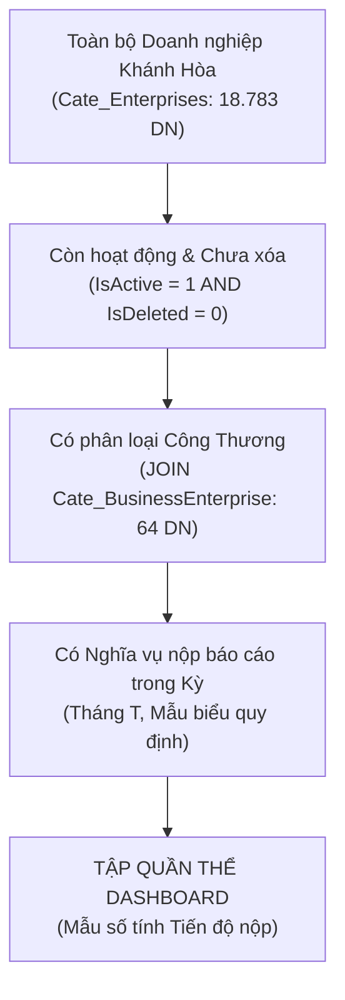
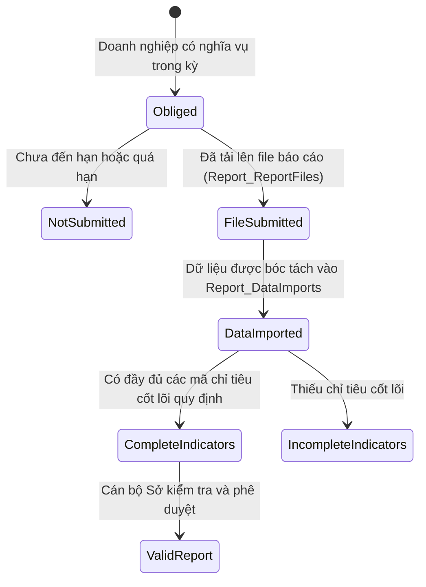
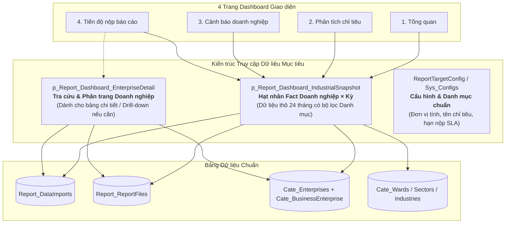

# BÁO CÁO KIỂM TOÁN KIẾN TRÚC DỮ LIỆU DASHBOARD, NGỮ NGHĨA BẢNG VÀ FIT/GAP STORED PROCEDURE
## (DASHBOARD DATA REQUIREMENT + TABLE SEMANTIC + STORED PROCEDURE FIT/GAP AUDIT)

**Dự án:** Hệ thống Báo cáo Thống kê Ngành Công Thương Khánh Hòa  
**Phạm vi:** 4 trang Dashboard (Tổng quan, Phân tích chỉ tiêu, Cảnh báo doanh nghiệp, Tiến độ nộp báo cáo)  
**Tình trạng hiện tại:** ĐÃ DỪNG TOÀN BỘ VIỆC SỬA ĐỔI GIAO DIỆN VÀ SQL PRODUCTION.  
**Nguyên tắc cốt lõi:**  
- Dự án chuyển đổi từ hệ thống cũ (Du lịch / Báo cáo chung), SP cũ và giao diện cũ KHÔNG PHẢI là chân lý (source of truth).  
- Bảng mới, lược đồ mới và ngữ nghĩa nghiệp vụ công thương mới quyết định kiến trúc dashboard.  
- Không giả định; mọi chỉ số chấp nhận phải truy vết được: **UI → Business Semantic → Calculation → SP/Query → New Table → Column**.

---

## MỤC LỤC
1. [DASHBOARD_ELEMENT_INVENTORY (Bảng kiểm kê từng phần tử Dashboard)](#1-dashboard_element_inventory)
2. [ĐỊNH NGHĨA NGỮ NGHĨA NGHIỆP VỤ MỚI (New Business Semantics)](#2-định-nghĩa-ngữ-nghĩa-nghiệp-vụ-mới)
3. [QUÉT CHI TIẾT CÁC BẢNG NỀN TẢNG (Table Deep-Scan)](#3-quét-chi-tiết-các-bảng-nền-tảng)
4. [TABLE_SEMANTIC_INVENTORY (Bảng kiểm kê ngữ nghĩa bảng dữ liệu)](#4-table_semantic_inventory)
5. [AUDIT ĐẶC BIỆT: DataReport_Imports VS Report_DataImports](#5-audit-đặc-biệt-datareport_imports-vs-report_dataimports)
6. [AUDIT BẢNG ReportTargetConfig (Danh mục chỉ tiêu thống kê)](#6-audit-bảng-reporttargetconfig)
7. [AUDIT BẢNG ReportDynamicGroupRule (Quy tắc nhóm động)](#7-audit-bảng-reportdynamicgrouprule)
8. [ENTERPRISE_COHORT_CONTRACT (Khế ước tập quần thể doanh nghiệp)](#8-enterprise_cohort_contract)
9. [INDUSTRY_SEMANTICS_CONTRACT (Ngữ nghĩa ngành kinh tế)](#9-industry_semantics_contract)
10. [PRODUCT_DATA_ASSESSMENT (Đánh giá dữ liệu sản phẩm)](#10-product_data_assessment)
11. [SUBMISSION_SEMANTIC_CONTRACT (Khế ước nộp báo cáo)](#11-submission_semantic_contract)
12. [SEMANTIC_SOURCE_MATRIX (Ma trận nguồn dữ liệu ngữ nghĩa)](#12-semantic_source_matrix)
13. [ÁNH XẠ DỮ LIỆU YÊU CẦU CHO 4 TRANG DASHBOARD](#13-ánh-xạ-dữ-liệu-yêu-cầu-cho-4-trang-dashboard)
14. [QUÉT TOÀN BỘ CÁC STORED PROCEDURE LIÊN QUAN](#14-quét-toàn-bộ-các-stored-procedure-liên-quan)
15. [SP_FIT_GAP_MATRIX (Ma trận Fit/Gap Stored Procedure)](#15-sp_fit_gap_matrix)
16. [ĐÁNH GIÁ ĐẶC BIỆT p_Report_Dashboard_IndustrialSnapshot](#16-đánh-giá-đặc-biệt-p_report_dashboard_industrialsnapshot)
17. [CÁC QUY TẮC QUYẾT ĐỊNH (Decision Rules)](#17-các-quy-tắc-quyết-định)
18. [KIẾN TRÚC STORED PROCEDURE MỤC TIÊU (Target SP Architecture)](#18-kiến-trúc-stored-procedure-mục-tiêu)
19. [KẾ HOẠCH TRIỂN KHAI CHI TIẾT (Implementation Plan)](#19-kế-hoạch-triển-khai-chi-tiết)
20. [MANDATORY FINAL DECISION TABLE (Bảng quyết định cuối cùng bắt buộc)](#20-mandatory-final-decision-table)

---

## 1. DASHBOARD_ELEMENT_INVENTORY

Khảo sát toàn bộ 4 trang dashboard hiện hữu (mã nguồn tại `CenIT.ReportTourism.Modules.ReportModule/Areas/Report/Views/Dashboard` và ViewModel `DashboardModel.cs`), bao gồm thẻ KPI, biểu đồ, tỷ lệ %, bảng, bộ lọc, nhãn trạng thái và các partial views.

| STT | Trang | Phân vùng (Section) | Phần tử UI (UI Element) | Nhãn hiện tại (Current Label) | View / Partial View | Trường ViewModel (ViewModel Field) | Ràng buộc JS (JS Binding) | Controller Action hiện tại | Biz Method hiện tại | SP / Truy vấn hiện tại | Cột nguồn hiện tại | Công thức hiện tại | Đơn vị | Phụ thuộc bộ lọc |
|:---:|:---|:---|:---|:---|:---|:---|:---|:---|:---|:---|:---|:---|:---|:---|
| 1 | Tất cả | Header / Nav | Tabs điều hướng | Tổng quan, Phân tích chỉ tiêu, Cảnh báo, Tiến độ | `_DashboardNavigation.cshtml` | `Active`, `Filters` | Không (HTML Link) | `Index`, `Analysis`, `Warnings`, `Progress` | `CreateFilters` | Không gọi SP | Route Values | Chuyển trang giữ bộ lọc | N/A | Year, Month, AreaId, SectorId, IndustryId, EnterpriseId, Metric |
| 2 | Tất cả | Header | Phạm vi dữ liệu | Scope Badge | `Index`, `Analysis`, `Warnings`, `Progress` | `FilterSummary` | Không | `Index`, `Analysis`, `Warnings`, `Progress` | `GetDashboard`, v.v. | `IndustrialSnapshot` | `BusinessName` count | "Tháng MM/yyyy · N doanh nghiệp..." | N/A | Year, Month, Bộ lọc kích thước |
| 3 | Tất cả | Bộ lọc (Filters) | Dropdown Chọn Chỉ tiêu | Chỉ tiêu | `_DashboardFilters.cshtml` | `FilterOptions.Metrics` | Select2 (`#metric`) | `Analysis` | `BuildFilterOptions` | Hardcoded C# | Code '0101', '06', '07' | Danh sách tĩnh 3 chỉ tiêu | N/A | Chỉ hiển thị ở trang Analysis |
| 4 | Tất cả | Bộ lọc | Dropdown Chọn Năm | Năm | `_DashboardFilters.cshtml` | `FilterOptions.Years` | Select2 (`#year`) | Tất cả 4 Actions | `BuildFilterOptions` | `IndustrialSnapshot` | `ForMonth` | Distinct Year từ snapshot + năm hiện tại | Năm | Phụ thuộc dữ liệu năm có trong DB |
| 5 | Tất cả | Bộ lọc | Dropdown Chọn Tháng | Tháng | `_DashboardFilters.cshtml` | `FilterOptions.Months` | Select2 (`#month`) | Tất cả 4 Actions | `BuildFilterOptions` | Hardcoded C# | 1..12 | Tháng 1 đến Tháng 12 | Tháng | Độc lập |
| 6 | Tất cả | Bộ lọc | Dropdown Chọn Địa bàn | Phường / xã | `_DashboardFilters.cshtml` | `FilterOptions.Areas` | Select2 (`#areaId`) | Tất cả 4 Actions | `BuildFilterOptions` | `IndustrialSnapshot` | `WardId`, `WardName` | Distinct từ Cohort trong Snapshot | N/A | Đồng bộ với tập cohort |
| 7 | Tất cả | Bộ lọc | Dropdown Khu vực KT | Khu vực kinh tế | `_DashboardFilters.cshtml` | `FilterOptions.EconomicSectors` | Select2 (`#economicSectorId`) | Tất cả 4 Actions | `BuildFilterOptions` | `IndustrialSnapshot` | `EconomicSectorId`, `Name` | Distinct từ Cohort trong Snapshot | N/A | Đồng bộ với tập cohort |
| 8 | Tất cả | Bộ lọc | Dropdown Ngành chính | Ngành chính | `_DashboardFilters.cshtml` | `FilterOptions.Industries` | Select2 (`#industryId`) | Tất cả 4 Actions | `BuildFilterOptions` | `IndustrialSnapshot` | `IndustryId`, `IndustryName` | Distinct từ token đầu tiên của IndustryIds | N/A | Chỉ lấy ngành đầu tiên |
| 9 | Tất cả | Bộ lọc | Dropdown Doanh nghiệp | Doanh nghiệp | `_DashboardFilters.cshtml` | `FilterOptions.Enterprises` | Select2 (`#enterpriseId`) | Tất cả 4 Actions | `BuildFilterOptions` | `IndustrialSnapshot` | `EnterpriseId`, `BusinessName` | Distinct từ Cohort trong Snapshot | N/A | Đồng bộ với tập cohort |
| 10 | Tất cả | Bộ lọc | Nút Thao tác | Lọc / Đặt lại | `_DashboardFilters.cshtml` | Form submit / Reset Link | Form Submit GET | Tất cả 4 Actions | Direct GET | N/A | N/A | N/A | N/A | Reload trang với tham số URL |
| 11 | Tổng quan | KPI Cards | Thẻ Doanh thu CN | Doanh thu công nghiệp | `_StatisticEnterprise.cshtml` | `Kpis[0].Value` | Không | `Index` | `Kpi` | `IndustrialSnapshot` | `IndustrialRevenue` | `SUM(PerformInPeriod)` với `Code='0101'` | Tỷ đồng | Tất cả bộ lọc |
| 12 | Tổng quan | KPI Cards | MoM Doanh thu CN | T.trước: +/-X% | `_StatisticEnterprise.cshtml` | `Kpis[0].Mom` | Không | `Index` | `Rate(..., -1)` | `IndustrialSnapshot` | `IndustrialRevenue` | `(Sum(Cur) - Sum(Prior)) / Sum(Prior) * 100` (cùng tập DN) | % | Tất cả bộ lọc |
| 13 | Tổng quan | KPI Cards | YoY Doanh thu CN | Cùng kỳ: +/-X% | `_StatisticEnterprise.cshtml` | `Kpis[0].Yoy` | Không | `Index` | `Rate(..., -12)` | `IndustrialSnapshot` | `IndustrialRevenue` | `(Sum(Cur) - Sum(YoY)) / Sum(YoY) * 100` (cùng tập DN) | % | Tất cả bộ lọc |
| 14 | Tổng quan | KPI Cards | Thẻ Xuất khẩu | Xuất khẩu | `_StatisticEnterprise.cshtml` | `Kpis[1].Value` | Không | `Index` | `Kpi` | `IndustrialSnapshot` | `ExportValue` | `SUM(PerformInPeriod)` với `Code='06'` | 1.000 USD | Tất cả bộ lọc |
| 15 | Tổng quan | KPI Cards | MoM/YoY Xuất khẩu | T.trước / Cùng kỳ | `_StatisticEnterprise.cshtml` | `Kpis[1].Mom`, `Yoy` | Không | `Index` | `Rate` | `IndustrialSnapshot` | `ExportValue` | Tỷ lệ tăng trưởng tập DN tương thích | % | Tất cả bộ lọc |
| 16 | Tổng quan | KPI Cards | Thẻ Nhập khẩu | Nhập khẩu | `_StatisticEnterprise.cshtml` | `Kpis[2].Value` | Không | `Index` | `Kpi` | `IndustrialSnapshot` | `ImportValue` | `SUM(PerformInPeriod)` với `Code='07'` | 1.000 USD | Tất cả bộ lọc |
| 17 | Tổng quan | KPI Cards | MoM/YoY Nhập khẩu | T.trước / Cùng kỳ | `_StatisticEnterprise.cshtml` | `Kpis[2].Mom`, `Yoy` | Không | `Index` | `Rate` | `IndustrialSnapshot` | `ImportValue` | Tỷ lệ tăng trưởng tập DN tương thích | % | Tất cả bộ lọc |
| 18 | Tổng quan | KPI Cards | Thẻ Tỷ lệ báo cáo | Tỷ lệ báo cáo | `_StatisticEnterprise.cshtml` | `Kpis[3].Value`, `Note` | Không | `Index` | `Submission` | `IndustrialSnapshot` | `Submitted`, `EnterpriseId` | `Submitted / TotalEnterprises * 100` | % | Tất cả bộ lọc |
| 19 | Tổng quan | Trend Panel | Biểu đồ xu hướng 12 tháng | Doanh thu CN theo tháng | `_StatisticVisitor.cshtml` | `MonthlyTrend` | Morris.Line (`#management-trend-chart`) qua JSON `trend` | `Index` | `IndicatorTrend` | `IndustrialSnapshot` | `ForMonth`, `IndustrialRevenue` | `SUM(IndustrialRevenue)` theo từng tháng trong 12 tháng gần nhất | Tỷ đồng | Tất cả bộ lọc |
| 20 | Tổng quan | Trend Panel | Empty State Trend | Chưa đủ tháng báo cáo... | `_StatisticVisitor.cshtml` | `MonthlyTrend.Count < 2` | Không | `Index` | `IndicatorTrend` | `IndustrialSnapshot` | N/A | Kiểm tra số tháng có dữ liệu < 2 | N/A | Tất cả bộ lọc |
| 21 | Tổng quan | Cơ cấu khu vực | Stacked Bar Cơ cấu | Khu vực kinh tế | `_StatisticTypeBusiness.cshtml` | `SectorContributions` | CSS Flexbox width % | `Index` | `SectorShares` | `IndustrialSnapshot` | `EconomicSectorName`, Revenue, Export, Import | Tỷ trọng giá trị từng khu vực / Tổng giá trị có chỉ tiêu * 100 | % | Tất cả bộ lọc |
| 22 | Tổng quan | Biến động DN | Top DN tăng mạnh | Tăng nhiều nhất | `_EnterpriseMovement.cshtml` | `IncreasingEnterprises` | CSS width % | `Index` | `EnterpriseImpacts` | `IndustrialSnapshot` | `BusinessName`, `IndustrialRevenue` | Top 3 DN có `Change = Cur - Prior > 0` | Tỷ đồng | Tất cả bộ lọc |
| 23 | Tổng quan | Biến động DN | Top DN giảm mạnh | Giảm nhiều nhất | `_EnterpriseMovement.cshtml` | `DecreasingEnterprises` | CSS width % | `Index` | `EnterpriseImpacts` | `IndustrialSnapshot` | `BusinessName`, `IndustrialRevenue` | Top 3 DN có `Change = Cur - Prior < 0` | Tỷ đồng | Tất cả bộ lọc |
| 24 | Tổng quan | Tiến độ nộp tệp | Ring Chart Tỷ lệ nộp | Tình hình nộp báo cáo | `_DashboardSubmissionDetails.cshtml`| `Submission` | CSS Conic-gradient `--completion` | `Index` | `Submission` | `IndustrialSnapshot` | `Submitted`, `Total` | `Submitted / Total * 100` | % | Tất cả bộ lọc |
| 25 | Tổng quan | Tiến độ nộp tệp | Số lượng nộp/chưa/đủ/thiếu/muộn | Đã nộp, Chưa nộp, v.v. | `_DashboardSubmissionDetails.cshtml`| `Submission.*` | Không | `Index` | `Submission` | `IndustrialSnapshot` | `Submitted`, `IsLate`, Chỉ tiêu | Đếm số lượng theo cờ trạng thái | Doanh nghiệp | Tất cả bộ lọc |
| 26 | Tổng quan | Cảnh báo biến động | 3 Thanh mức độ giảm | Giảm >10%, >20%, >30% | `_DashboardAlerts.cshtml` | `Alerts.DeclineOver*` | CSS width % | `Index` | `Alerts` | `IndustrialSnapshot` | `IndustrialRevenue` | Đếm DN có mức giảm vượt ngưỡng 10/20/30% | Doanh nghiệp | Tất cả bộ lọc |
| 27 | Phân tích | KPI Cards | Giá trị kỳ hiện tại | [Metric] hiện tại | `Analysis.cshtml` | `CurrentValue` | Không | `Analysis` | `GetAnalysis` | `IndustrialSnapshot` | `PerformInPeriod` | `SUM(PerformInPeriod)` theo metric đã chọn | Tỷ đồng / 1.000 USD | Metric + Bộ lọc |
| 28 | Phân tích | KPI Cards | Tăng trưởng MoM/YoY | So với tháng trước / Cùng kỳ | `Analysis.cshtml` | `Mom`, `Yoy` | Không | `Analysis` | `Rate` | `IndustrialSnapshot` | `PerformInPeriod` | So sánh tổng của cùng tập DN có số liệu cả 2 kỳ | % | Metric + Bộ lọc |
| 29 | Phân tích | KPI Cards | Lũy kế đầu năm (YTD) | Lũy kế từ đầu năm | `Analysis.cshtml` | `YtdValue` | Không | `Analysis` | `GetAnalysis` | `IndustrialSnapshot` | `PerformInPeriod` | Tổng từ tháng 1 đến tháng hiện tại (nếu tất cả các tháng đều có số liệu) | Tỷ đồng / 1.000 USD | Metric + Bộ lọc |
| 30 | Phân tích | Cơ cấu khu vực | Thanh tỷ trọng khu vực | Đóng góp theo KV kinh tế | `Analysis.cshtml` | `SectorContributions` | CSS width % | `Analysis` | `SectorShares` | `IndustrialSnapshot` | `EconomicSectorName` | Tỷ trọng giá trị khu vực / Tổng giá trị kỳ * 100 | % | Metric + Bộ lọc |
| 31 | Phân tích | Đóng góp ngành | Thanh thay đổi theo ngành | Đóng góp theo ngành | `Analysis.cshtml` | `IndustryContributions` | CSS width % | `Analysis` | `ImpactsByIndustry` | `IndustrialSnapshot` | `IndustryName`, Metric | `SUM(Change)` của các DN thuộc ngành | Tỷ đồng / 1.000 USD | Metric + Bộ lọc |
| 32 | Phân tích | Tác động DN | Top DN thay đổi lớn nhất | Doanh nghiệp tác động lớn | `Analysis.cshtml` | `EnterpriseImpact` | CSS width % | `Analysis` | `EnterpriseImpacts` | `IndustrialSnapshot` | `BusinessName`, Metric | Top 8 DN có `ABS(Change)` lớn nhất | Tỷ đồng / 1.000 USD | Metric + Bộ lọc |
| 33 | Phân tích | Lý do biến động | Danh sách lý do | Doanh nghiệp cho biết | `_ReportedReasons.cshtml` | `Reasons` | Không | `Analysis` | `Reasons` | `IndustrialSnapshot` | `Reason` (từ `Report_ReportFiles`) | 8 lý do gần nhất có nội dung text | Text | Metric + Bộ lọc |
| 34 | Phân tích | Bảng đối chiếu | Bảng tổng hợp chỉ tiêu kỳ | Bảng tổng hợp chỉ tiêu theo kỳ | `Analysis.cshtml` | Table Row | Không | `Analysis` | `GetAnalysis` | `IndustrialSnapshot` | Tổng hợp từ các trường KPI | Hiển thị bảng so sánh Cur, MoM, YoY, YTD | Bảng | Metric + Bộ lọc |
| 35 | Cảnh báo | Thẻ KPI Cảnh báo | 4 Thẻ mức độ cảnh báo | Giảm >10%, >20%, >30%, Cần làm việc ngay | `Warnings.cshtml` | `Summary.*` | Không | `Warnings` | `Alerts` | `IndustrialSnapshot` | `IndustrialRevenue` | Đếm DN có `Percent < -10%, -20%, -30%` (Urgent = >30%) | Doanh nghiệp | Tất cả bộ lọc |
| 36 | Cảnh báo | Phân bố mức độ | Donut Mức độ cảnh báo | Mức độ cảnh báo | `Warnings.cshtml` | `Summary` | Morris.Donut (`#warning-severity-chart`) qua JSON `severity` | `Warnings` | `GetWarnings` | `IndustrialSnapshot` | `Summary` counts | Chia dải không trùng: 10-20% (Over10-Over20), 20-30% (Over20-Over30), >30% (Over30) | Doanh nghiệp | Tất cả bộ lọc |
| 37 | Cảnh báo | Xu hướng cảnh báo | Line Chart Cảnh báo thời gian | Cảnh báo theo thời gian | `Warnings.cshtml` | `Trend` | Morris.Line (`#warning-trend-chart`) qua JSON `warning-trend` | `Warnings` | `GetWarnings` | `IndustrialSnapshot` | Lịch sử các tháng | Đếm DN vi phạm ngưỡng qua từng tháng 1..tháng hiện tại | Doanh nghiệp | Tất cả bộ lọc |
| 38 | Cảnh báo | Cảnh báo theo ngành | Danh sách ngành có cảnh báo | Cảnh báo theo ngành | `Warnings.cshtml` | `ByIndustry` | CSS width % | `Warnings` | `GetWarnings` | `IndustrialSnapshot` | `IndustryName` | Nhóm DN vi phạm theo ngành, sắp xếp số lượng giảm dần | Doanh nghiệp | Tất cả bộ lọc |
| 39 | Cảnh báo | Bảng DN cần xử lý | Bảng chi tiết DN ưu tiên | Danh sách DN cần ưu tiên xử lý | `Warnings.cshtml` | `UrgentEnterprises` | Table Render | `Warnings` | `GetWarnings` | `IndustrialSnapshot` | `BusinessName`, Industry, Cur, Prior, Change, Percent | Danh sách DN giảm >10%, xếp theo Change tăng dần (âm nhiều nhất) | Bảng | Tất cả bộ lọc |
| 40 | Tiến độ | Headline Bar | Thanh tiến độ tổng quan | Tiến độ hoàn thành báo cáo | `Progress.cshtml` | `Submission` | CSS width % | `Progress` | `Submission` | `IndustrialSnapshot` | `Submitted`, `Total` | `Submitted / Total * 100` | % | Tất cả bộ lọc |
| 41 | Tiến độ | 6 Thẻ KPI | 6 Thẻ trạng thái báo cáo | Dự kiến, Đã nộp tệp, Đủ 3 mã, Thiếu mã, Chưa nộp, Nộp muộn | `Progress.cshtml` | `Submission.*` | Không | `Progress` | `Submission` | `IndustrialSnapshot` | `Submitted`, `IsLate`, Indicators | Đếm số lượng DN theo từng trạng thái | Doanh nghiệp | Tất cả bộ lọc |
| 42 | Tiến độ | Xu hướng hoàn thành | Line Chart Tiến độ theo tháng | Tỷ lệ hoàn thành theo tháng | `Progress.cshtml` | `Trend` | Morris.Line (`#completion-trend-chart`) qua JSON `completion-trend` | `Progress` | `GetProgress` | `IndustrialSnapshot` | `Submitted`, `Total` theo tháng | Tỷ lệ % nộp tệp qua các tháng trong năm | % | Tất cả bộ lọc |
| 43 | Tiến độ | Phường / Xã | Tiến độ theo địa bàn | Nộp tệp theo phường / xã | `Progress.cshtml` | `Areas` | CSS width % | `Progress` | `Breakdown(..., WardName)` | `IndustrialSnapshot` | `WardName`, `Submitted` | Đếm nộp / chưa nộp, tính % theo từng phường xã | % | Tất cả bộ lọc |
| 44 | Tiến độ | Ngành chính | Tiến độ theo ngành | Nộp tệp theo ngành chính | `Progress.cshtml` | `Industries` | CSS width % | `Progress` | `Breakdown(..., IndustryName)` | `IndustrialSnapshot` | `IndustryName`, `Submitted` | Đếm nộp / chưa nộp, tính % theo từng ngành chính | % | Tất cả bộ lọc |
| 45 | Tiến độ | Đơn vị đôn đốc | Grid các đơn vị nợ báo cáo | Đơn vị cần đôn đốc nộp báo cáo | `Progress.cshtml` | `OutstandingAreas` | Grid CSS | `Progress` | `GetProgress` | `IndustrialSnapshot` | Ward + Industry | Top 4 đơn vị (địa bàn/ngành) có `NotSubmitted` lớn nhất | Doanh nghiệp | Tất cả bộ lọc |

---

## 2. ĐỊNH NGHĨA NGỮ NGHĨA NGHIỆP VỤ MỚI

Bảng sau đây định nghĩa chính xác ngữ nghĩa nghiệp vụ **MỤC TIÊU** mà hệ thống mới phải phản ánh cho từng nhóm phần tử, không thừa kế mù quáng từ hệ thống cũ:

### 2.1. Nhóm chỉ tiêu kinh tế (Doanh thu công nghiệp, Xuất khẩu, Nhập khẩu)
- **Câu hỏi nghiệp vụ (Business Question):** Trong kỳ báo cáo được chọn, tổng giá trị sản xuất công nghiệp thực hiện, kim ngạch xuất khẩu và kim ngạch nhập khẩu của các doanh nghiệp thuộc đối tượng quản lý công thương là bao nhiêu? Mức tăng trưởng so với kỳ trước và cùng kỳ năm trước biến động ra sao?
- **Định nghĩa ngữ nghĩa (Semantic Definition):**
  - **Doanh thu sản xuất công nghiệp:** Là giá trị chỉ tiêu mã `0101` ("Trong đó doanh thu công nghiệp", đơn vị Tỷ đồng) phát sinh trong kỳ của các doanh nghiệp công nghiệp. **Tuyệt đối không gán nhãn GTSXCN** (Giá trị sản xuất công nghiệp theo giá so sánh/hiện hành) vì mẫu biểu báo cáo hiện tại chỉ thu thập Doanh thu công nghiệp.
  - **Kim ngạch xuất khẩu:** Là giá trị chỉ tiêu mã `06` ("Kim ngạch xuất khẩu", đơn vị 1.000 USD).
  - **Kim ngạch nhập khẩu:** Là giá trị chỉ tiêu mã `07` ("Kim ngạch nhập khẩu", đơn vị 1.000 USD).
- **Hạt nhân dữ liệu (Grain):** `EnterpriseId` + `ForMonth` + `Code` + `TypeReport`.
- **Quần thể (Population):** Doanh nghiệp công nghiệp thuộc diện có nghĩa vụ báo cáo trong kỳ.
- **Kỳ báo cáo (Period):** Tháng báo cáo (`ForMonth`).
- **Thước đo (Measure):** `PerformInPeriod` (Số thực hiện trong kỳ).
- **Đơn vị tính (Unit):** Mã `0101`: Tỷ đồng; Mã `06`, `07`: 1.000 USD. Không bao giờ cộng gộp giữa các đơn vị tính khác nhau.
- **Quy tắc thiếu dữ liệu (Missing Data Rule):** Nếu doanh nghiệp không có bản ghi hoặc trường giá trị là NULL, coi là "Chưa có dữ liệu" (Unknown/Missing), không được tự ý ép thành 0 để tính trung bình hay tính tỷ trọng.
- **Quy tắc giá trị 0 (Zero Data Rule):** Nếu doanh nghiệp có nhập số 0 hợp lệ (ví dụ không phát sinh xuất khẩu), giá trị 0 là một quan sát thực tế (Observed Zero), được tính vào tổng và độ bao phủ.
- **Quy tắc so sánh (Comparison Rule):** Tăng trưởng MoM và YoY chỉ được tính trên **tập doanh nghiệp tương thích (Comparable Cohort)** — tức các doanh nghiệp có số liệu ở cả 2 kỳ so sánh. Nếu baseline kỳ trước = 0 hoặc missing, không tính tỷ lệ % tăng trưởng (tránh chia cho 0).

### 2.2. Nhóm tiến độ nộp báo cáo (Reporting Progress)
- **Câu hỏi nghiệp vụ:** Trong số các doanh nghiệp có nghĩa vụ nộp báo cáo thống kê trong tháng được chọn, bao nhiêu đơn vị đã nộp tệp, bao nhiêu đơn vị đã nhập dữ liệu chỉ tiêu, bao nhiêu đơn vị nộp muộn, và tỷ lệ hoàn thành là bao nhiêu?
- **Định nghĩa ngữ nghĩa:**
  - **Tỷ lệ nộp báo cáo:** `(Số doanh nghiệp đã nộp tệp hợp lệ trong kỳ) / (Tổng số doanh nghiệp CÓ NGHĨA VỤ báo cáo trong kỳ) * 100`.
  - Mẫu số (Denominator) **bắt buộc phải là danh sách doanh nghiệp có nghĩa vụ tại kỳ đó**, không được lấy tổng toàn bộ doanh nghiệp trong danh bạ (18.783 DN) và cũng không được lấy cố định 64 DN nếu chưa có hợp đồng nghĩa vụ kỳ.
- **Hạt nhân dữ liệu (Grain):** `EnterpriseId` + `ForMonth` + `TypeReport`.
- **4 trạng thái tiến độ độc lập:**
  1. *Đã nộp tệp (File Submitted):* Có bản ghi `Report_ReportFiles` hợp lệ, không bị xóa (`IsDeleted=0`).
  2. *Đã nhập dữ liệu (Data Imported):* Có các bản ghi chi tiết trong `Report_DataImports` tương ứng.
  3. *Đủ chỉ tiêu bắt buộc (Complete Indicators):* Có đầy đủ các mã chỉ tiêu quy định cho mẫu báo cáo đó (không bắt buộc mọi DN đều phải có cả 06 và 07 nếu DN không có hoạt động XNK).
  4. *Báo cáo hợp lệ (Valid Report):* Đã được thẩm xét/duyệt bởi Sở Công Thương.
- **Quy tắc nộp muộn (Lateness Rule):** Dựa trên `IsLate` được tính toán đối chiếu ngày nộp (`CreatedDate`) với cấu hình hạn nộp trong `Sys_Configs` (`Day_Deadline_Send_Report`).

### 2.3. Nhóm cảnh báo doanh nghiệp (Enterprise Warnings)
- **Câu hỏi nghiệp vụ:** Những doanh nghiệp nào có quy mô sụt giảm doanh thu nghiêm trọng (>10%, >20%, >30%) so với tháng trước cần Sở can thiệp, kiểm tra hoặc đôn đốc?
- **Định nghĩa ngữ nghĩa:** Cảnh báo kinh tế dựa trên mức giảm phần trăm doanh thu công nghiệp (`Code='0101'`) của cùng một doanh nghiệp giữa 2 tháng liên tiếp: `Percent = (Current - Previous) / Previous * 100`.
- **Điều kiện kích hoạt:**
  - Doanh nghiệp phải có dữ liệu doanh thu ở cả tháng trước và tháng này.
  - Doanh thu tháng trước phải > 0 (`Previous > 0`).
  - `Percent < -10%` (mức 1), `Percent < -20%` (mức 2), `Percent < -30%` (mức 3 - Cần làm việc ngay).
- **Phân định dải cảnh báo (Donut Slices):** Các dải hiển thị biểu đồ Donut phải là **rời rạc (mutually exclusive)**:
  - Dải 1: Giảm từ 10% đến 20% (`Over10 - Over20`).
  - Dải 2: Giảm từ 20% đến 30% (`Over20 - Over30`).
  - Dải 3: Giảm trên 30% (`Over30`).

---

## 3. QUÉT CHI TIẾT CÁC BẢNG NỀN TẢNG

Khảo sát cấu trúc, mã nguồn, XML mappings và dữ liệu của 14 bảng trọng yếu thuộc 2 Database (`baocao.sct.cenit.vn` - Báo cáo, viết tắt **R**, và `baocao.sct.cenit.vn.cate` - Danh mục, viết tắt **C**):

### Nhóm Bảng Báo cáo / Dữ liệu (Report & Data Tables):
1. **`DataReport_Imports` (R):**
   - Không tìm thấy bất kỳ lời gọi nào từ mã nguồn C# (`grep -rn "DataReport_Imports" Source/` trả về rỗng).
   - Không có thủ tục hay mapping XML nào tham chiếu đến bảng này.
   - Bảng này là tàn dư từ giai đoạn phát triển ban đầu hoặc bảng staging thử nghiệm không được đưa vào luồng nghiệp vụ chính.
2. **`Report_DataImports` (R):**
   - Bảng sự thật trung tâm lưu trữ toàn bộ số liệu báo cáo định kỳ theo từng chỉ tiêu.
   - Cột quan trọng: `EnterpriseId` (int), `ForMonth` (date/datetime), `TypeReport` (int), `TypeReportName` (nvarchar), `Code` (varchar), `Targets` (nvarchar), `Unit` (nvarchar), `PerformPreviousPeriod` (float/decimal), `PerformInPeriod` (float/decimal), `AccumulatedBeginingOfYear` (float/decimal), `ComparedSamePeriodLastYear` (float/decimal), `IsDeleted` (bit), `CreatedDate`, `CreatedBy`.
   - Ghi dữ liệu: `ReportDataImportBiz.Import` → gọi SP `p_Report_DataImports_ImportDatas`.
   - Đọc dữ liệu: `Report_DataImports_Get*`, `p_Report_Reports_04_*`, `usp_Report_KTXH`, `p_Report_Dashboard_IndustrialSnapshot`.
3. **`Report_ReportFiles` (R):**
   - Quản lý tệp báo cáo đính kèm và trạng thái nộp của doanh nghiệp theo kỳ.
   - Cột quan trọng: `EnterpriseId`, `ForMonth`, `ReportFile` (đường dẫn file), `Reason` (lý do biến động), `IsLate` (bit), `IsDeleted` (bit), `CreatedDate`, `CreatedBy`.
   - Ghi dữ liệu: SP `p_Report_DataImports_ImportDatas` khi upload file báo cáo.
   - Đọc dữ liệu: `p_Report_Dashboard_IndustrialSnapshot`.
4. **`ReportDynamicGroupRule` (R):**
   - Lưu trữ các quy tắc nhóm động và công thức tính tổng hợp cho các biểu mẫu báo cáo phức tạp (như mẫu KTXH tỉnh).
   - Được tham chiếu bởi SP `usp_Report_KTXH` trên SQL Server. Không được tham chiếu trực tiếp trong C#.
5. **`ReportTargetConfig` (R):**
   - Bảng danh mục cấu hình chỉ tiêu thống kê chuẩn cho các loại báo cáo.
   - Chứa `Code`, `Targets` (tên chỉ tiêu), `Unit` (đơn vị tính), `TypeReport`. Được SP `usp_Report_KTXH` join để lấy danh mục chỉ tiêu chuẩn.

### Nhóm Bảng Báo cáo / Dữ liệu (Report & Data Tables):
1. **`DataReport_Imports` (R):**
   - **Xác minh trực tiếp trên DB:** Có đúng **0 dòng** (`COUNT(*) = 0`).
   - Hoàn toàn không có tham chiếu nào trong C# hay XML mappings.
   - Bảng này là tàn dư thử nghiệm không được đưa vào luồng nghiệp vụ.
2. **`Report_DataImports` (R):**
   - **Xác minh trực tiếp trên DB:** Có **455 dòng dữ liệu thực tế** (bao gồm cả chuỗi dữ liệu 24 tháng từ `2025-01-01` đến `2026-12-01` do nghiệp vụ nạp ngày 28/09/2026).
   - Bảng sự thật trung tâm lưu trữ toàn bộ số liệu báo cáo định kỳ theo từng chỉ tiêu.
   - Phân bố dữ liệu theo mã chỉ tiêu thực tế:
     - `01` (Tổng doanh thu - Tỷ đồng): 46 dòng
     - `0101` (Trong đó doanh thu công nghiệp - Tỷ đồng): 46 dòng
     - `03A` (Tổng số lao động - Người): 46 dòng
     - `03B` (Thu nhập bình quân - Tr.đồng): 46 dòng
     - `05` (Nộp ngân sách - Tr.đồng): 46 dòng
     - `06` (Kim ngạch xuất khẩu - 1.000 USD): 46 dòng
     - `07` (Kim ngạch nhập khẩu - 1.000 USD): 46 dòng
     - `3512200` (Điện gió - kWh): 45 dòng
     - `XKB051` (Điện - 1000USD): 44 dòng
     - `NKB050` (Máy móc thiết bị, DCPT khác - 1000USD): 23 dòng
     - `NKB051` (Dây điện và dây cáp điện - 1000USD): 21 dòng
   - Ghi dữ liệu: `ReportDataImportBiz.Import` → gọi SP `p_Report_DataImports_ImportDatas`.
   - Đọc dữ liệu: `Report_DataImports_Get*`, `p_Report_Reports_04_*`, `usp_Report_KTXH`, `p_Report_Dashboard_IndustrialSnapshot`.
3. **`Report_ReportFiles` (R):**
   - **Xác minh trực tiếp trên DB:** Có **8 dòng nộp tệp** cho kỳ `2026-09-01` (gồm các DN `447`, `448`, `455`, `511`, `22886`, `22887`, `23128`...).
   - Có 3 trường hợp nộp muộn (`IsLate = 1`), 5 trường hợp đúng hạn (`IsLate = 0`).
   - Cột quan trọng: `EnterpriseId`, `ForMonth`, `ReportFile`, `Reason`, `IsLate`, `IsDeleted`, `CreatedDate`.
   - Ghi dữ liệu: SP `p_Report_DataImports_ImportDatas` khi upload file báo cáo.
   - Đọc dữ liệu: `p_Report_Dashboard_IndustrialSnapshot`.
4. **`ReportDynamicGroupRule` (R):**
   - **Xác minh trực tiếp trên DB:** Có đúng **3 dòng quy tắc**:
     - `RuleId = 1`: `ParentCode = 'SPCN'`, `CodePattern = '02%'`, `IndentLevel = 1`
     - `RuleId = 2`: `ParentCode = '06'`, `CodePattern = '06%'`, `IndentLevel = 1`
     - `RuleId = 3`: `ParentCode = '07'`, `CodePattern = '07%'`, `IndentLevel = 1`
   - Mục đích: Gom nhóm động các mặt hàng chi tiết vào nhóm "Sản phẩm công nghiệp chủ yếu" (`SPCN`), "Xuất khẩu" (`06`) và "Nhập khẩu" (`07`).
   - Được tham chiếu bởi SP `usp_Report_KTXH` trên SQL Server. Không phục vụ trực tiếp 4 trang Dashboard.
5. **`ReportTargetConfig` (R):**
   - **Xác minh trực tiếp trên DB:** Có đúng **9 dòng cấu hình chỉ tiêu chuẩn**:
     - `Code = '01'`: `Targets = 'Tổng doanh thu'`, `Unit = 'Tỷ đồng'`, `DisplayOrder = 10`
     - `Code = '0101'`: `Targets = 'Trong đó doanh thu công nghiệp'`, `Unit = 'Tỷ đồng'`, `DisplayOrder = 20`, `ParentCode = '01'`, `IsItalic = 1`
     - `Code = 'SPCN'`: `Targets = 'Sản phẩm công nghiệp chủ yếu'`, `DisplayOrder = 30`
     - `Code = 'LDTN'`: `Targets = 'Lao động - Thu nhập'`, `DisplayOrder = 80`
     - `Code = '03A'`: `Targets = 'Tổng số lao động'`, `Unit = 'Người'`, `DisplayOrder = 90`, `ParentCode = 'LDTN'`
     - `Code = '03B'`: `Targets = 'Thu nhập bình quân/người/tháng'`, `Unit = 'Tr.đồng'`, `DisplayOrder = 100`, `ParentCode = 'LDTN'`
     - `Code = '05'`: `Targets = 'Nộp ngân sách'`, `Unit = 'Tr.đồng'`, `DisplayOrder = 110`
     - `Code = '06'`: `Targets = 'Kim ngạch xuất khẩu'`, `Unit = '1.000 USD'`, `DisplayOrder = 120`
     - `Code = '07'`: `Targets = 'Kim ngạch nhập khẩu'`, `Unit = '1.000 USD'`, `DisplayOrder = 140`

### Nhóm Bảng Doanh nghiệp / Danh mục (Enterprise & Category Tables):
6. **`Cate_BusinessEnterprise` (C):**
   - **Xác minh trực tiếp trên DB:** Có **78 doanh nghiệp công thương** (trong đó có 66 doanh nghiệp đang ở trạng thái `IsActive = 1 AND IsDeleted = 0` trên `Cate_Enterprises`).
   - 77 doanh nghiệp đã có `IndustryIds` (dạng chuỗi CSV, ví dụ `'2845'`, `'2971,2983,3046'`).
   - Toàn bộ 78 DN hiện đều có `EnterpriseStatusId = 1` (Đang hoạt động), thuộc 3 khu vực kinh tế (chủ yếu `EconomicSectorId = 2` - Kinh tế ngoài nhà nước và `3` - FDI).
7. **`Cate_BusinessEnterpriseProduct` (C):**
   - **Xác minh trực tiếp trên DB:** Có **74 bản ghi** phân công sản phẩm cho doanh nghiệp.
8. **`Cate_BusinessIndustry` (C):**
   - **Xác minh trực tiếp trên DB:** Có **1.606 ngành** kinh tế.
9. **`Cate_BusinessProduct` (C):**
   - **Xác minh trực tiếp trên DB:** Có **7.220 sản phẩm** và mặt hàng XNK chuẩn.
10. **`Cate_EconomicSector` (C):**
    - **Xác minh trực tiếp trên DB:** Có đúng **5 khu vực kinh tế**:
      - `1`: 'Kinh tế nhà nước' (`STATE`)
      - `2`: 'Kinh tế ngoài nhà nước' (`PRIVATE`)
      - `3`: 'Khu vực có vốn đầu tư nước ngoài' (`FDI`)
      - `4`: 'Khu vực kinh tế tập thể, hợp tác xã' (`COOPERATIVE`)
      - `5`: 'Khu vực kinh tế khác' (`OTHER`)
11. **`Cate_Enterprises` (C):**
    - **Xác minh trực tiếp trên DB:** Có **18.783 doanh nghiệp** toàn tỉnh.
12. **`Cate_EnterpriseStatus` (C):**
    - **Xác minh trực tiếp trên DB:** Có đúng **5 trạng thái**:
      - `1`: 'Đang hoạt động' (`ACTIVE`)
      - `2`: 'Tạm ngừng hoạt động' (`SUSPENDED`)
      - `3`: 'Đã giải thể' (`DISSOLVED`)
      - `4`: 'Phá sản' (`BANKRUPT`)
      - `5`: 'Chưa xác định' (`UNKNOWN`)
13. **`Cate_EnterpriseType` (C):**
    - **Xác minh trực tiếp trên DB:** Có đúng **8 loại hình doanh nghiệp**:
      - `DNNN`, `DNTN`, `CTCP`, `CTTNHH`, `HTX`, `LDNN`, `FDI`, `KHAC`.
14. **`Cate_Wards` (C):**
    - **Xác minh trực tiếp trên DB:** Có **3.321 phường/xã**.

### Bảng phát hiện thêm:
15. **`Sys_Configs` (C):** Có **16 tham số**, chứa `Day_Deadline_Send_Report` và `Day_Deadline_Send_Late_Report`.
16. **`Cate_EnterprisePermissions` (C):** Có **18.853 bản ghi** phân quyền doanh nghiệp cho người dùng.

---

## 4. TABLE_SEMANTIC_INVENTORY

| Bảng (Table) | CSDL (Database) | Hạt nhân (Grain) | Số dòng thực tế (Live Rows) | Khóa chính (PK) | Khóa nghiệp vụ (Business Key) | Mục đích nghiệp vụ (Purpose) | Các cột quan trọng (Important Columns) | Ghi từ đâu (Writes From) | Đọc từ đâu (Reads From) | Vai trò với Dashboard | Legacy / New | Độ tin cậy (Confidence) | Ghi chú kiến trúc (Notes) |
|:---|:---:|:---|:---:|:---|:---|:---|:---|:---|:---:|:---:|:---:|:---|
| `Report_DataImports` | R | DN × Kỳ × Mẫu × Mã chỉ tiêu | **455** | Candidate PK: `ReportId` | `(EnterpriseId, ForMonth, TypeReport, Code)` | Lưu trữ các giá trị chỉ tiêu thống kê do DN nhập | `EnterpriseId`, `ForMonth`, `TypeReport`, `Code`, `Targets`, `Unit`, `PerformInPeriod`, `IsDeleted` | `ImportController` → `ReportDataImportBiz` → `p_Report_DataImports_ImportDatas` | Dashboard SPs, Report SPs | **CỐT LÕI (CORE FACT)** | NEW | **LIVE 100%** | Là nguồn sự thật duy nhất về giá trị kinh tế. Cần lọc `IsDeleted=0`. |
| `DataReport_Imports` | R | Không xác định | **0** | Không có | Không có | Bảng tạm hoặc legacy import không sử dụng | Không có tham chiếu trong C# | Không có | Không có | **KHÔNG DÙNG (DO NOT USE)** | LEGACY / UNUSED | **LIVE 100%** | Bảng hoàn toàn rỗng trên DB. Mã nguồn C# không tương tác. |
| `Report_ReportFiles` | R | DN × Kỳ × Lần nộp | **8** | Candidate PK: `FileId` | `(EnterpriseId, ForMonth)` | Lưu vết hồ sơ tệp nộp, tính trễ hạn và lý do | `EnterpriseId`, `ForMonth`, `ReportFile`, `Reason`, `IsLate`, `IsDeleted`, `CreatedDate` | SP `p_Report_DataImports_ImportDatas` | `IndustrialSnapshot` | **CỐT LÕI (SUBMISSION FACT)** | NEW | **LIVE 100%** | Cần lấy bản ghi mới nhất theo `CreatedDate DESC` cho mỗi kỳ. |
| `ReportTargetConfig` | R | Mã chỉ tiêu chuẩn | **9** | Candidate PK: `TargetConfigId` | `Code` | Định nghĩa danh mục chỉ tiêu chuẩn và đơn vị tính | `Code`, `Targets`, `Unit`, `ParentCode`, `DisplayOrder`, `IndentLevel`, `IsItalic` | Quản trị cấu hình báo cáo | `usp_Report_KTXH` | **THAM KHẢO / CẤU HÌNH** | NEW | **LIVE 100%** | Có sẵn 9 dòng chuẩn (01, 0101, SPCN, LDTN, 03A, 03B, 05, 06, 07). |
| `ReportDynamicGroupRule` | R | Quy tắc nhóm báo cáo | **3** | `RuleId` | `ParentCode` | Công thức nhóm động cho biểu mẫu KTXH (02%->SPCN, 06%->06, 07%->07) | `RuleId`, `ParentCode`, `CodePattern`, `IndentLevel` | Quản trị mẫu biểu | `usp_Report_KTXH` | **KHÔNG LIÊN QUAN TRỰC TIẾP** | NEW | **LIVE 100%** | Phục vụ biểu mẫu KTXH, không áp dụng cho dashboard 4 trang. |
| `Cate_Enterprises` | C | Doanh nghiệp | **18.783** | `EnterpriseId` (int) | `TaxCode` (Mã số thuế) | Danh bạ tổng thể toàn bộ doanh nghiệp Khánh Hòa | `EnterpriseId`, `BusinessName`, `TaxCode`, `WardId`, `WardName`, `IsActive`, `IsDeleted` | Màn hình Quản lý DN (`EnterpriseController`) | Mọi module và dashboard | **DIMENSION CỐT LÕI** | NEW | **LIVE 100%** | Quy mô 18.783 DN. Chỉ tham gia dashboard khi thuộc diện quản lý. |
| `Cate_BusinessEnterprise` | C | Doanh nghiệp công thương | **78** | `EnterpriseId` (int/bigint) | `EnterpriseId` | Phân loại ngành, khu vực KT cho DN công thương | `EnterpriseId`, `IndustryIds`, `EconomicSectorId`, `EnterpriseTypeId`, `EnterpriseStatusId` | Màn hình Phân loại DN (`p_Cate_Enterprises_Save`) | `IndustrialSnapshot`, Cate Biz | **DIMENSION / COHORT LINK** | NEW | **LIVE 100%** | Có 78 DN công thương (66 DN đang active). `IndustryIds` dạng chuỗi CSV. |
| `Cate_BusinessIndustry` | C | Ngành kinh tế | **1.606** | `IndustryId` (int) | `IndustryCode` | Danh mục phân cấp ngành công nghiệp | `IndustryId`, `IndustryCode`, `IndustryName`, `ParentId`, `IsActive` | Danh mục ngành (`BusinessIndustryController`) | Dashboard, Import, Cate UI | **DIMENSION NGÀNH** | NEW | **LIVE 100%** | Cung cấp tên ngành và phân cấp ngành. |
| `Cate_EconomicSector` | C | Khu vực kinh tế | **5** | `EconomicSectorId` (int) | `Code` | Danh mục thành phần kinh tế (Nhà nước, Ngoài nhà nước, FDI, HTX, Khác) | `EconomicSectorId`, `Code`, `Name`, `IsActive` | Danh mục khu vực KT | `IndustrialSnapshot`, Cate UI | **DIMENSION KHU VỰC** | NEW | **LIVE 100%** | Phân rã tỷ trọng doanh thu/XNK theo khu vực sở hữu. |
| `Cate_Wards` | C | Phường / Xã | **3.321** | `WardId` (int) | Mã phường xã | Danh mục địa bàn hành chính cấp xã | `WardId`, `WardName`, `ProvinceId` | Danh mục địa bàn | Dashboard, Quản lý DN | **DIMENSION ĐỊA BÀN** | NEW | **LIVE 100%** | Phân tích tiến độ và dữ liệu theo địa bàn hành chính. |
| `Cate_EnterpriseStatus` | C | Trạng thái DN | **5** | `EnterpriseStatusId` (int) | `Code` | Danh mục trạng thái pháp lý (Hoạt động, Tạm ngừng, Giải thể, Phá sản..) | `EnterpriseStatusId`, `Code`, `Name` | Danh mục trạng thái | Quản lý DN | **BỘ LỌC ĐIỀU KIỆN (FILTER)** | NEW | **LIVE 100%** | Cần dùng để loại trừ doanh nghiệp giải thể / ngừng hoạt động. |
| `Cate_EnterpriseType` | C | Loại hình DN | **8** | `EnterpriseTypeId` (int) | `Code` | Danh mục hình thức tổ chức (CTCP, TNHH, DNTN, FDI..) | `EnterpriseTypeId`, `Code`, `Name` | Danh mục loại hình | Quản lý DN | **DIMENSION PHỤ** | NEW | **LIVE 100%** | Hiện tại dashboard chưa lọc theo loại hình này. |
| `Cate_BusinessEnterpriseProduct` | C | DN × Sản phẩm | **74** | Khóa tổ hợp | `(EnterpriseId, ProductId)` | Phân công sản phẩm cho DN báo cáo | `EnterpriseId`, `ProductId`, `IsActive` | Giao diện cấu hình SP cho DN | `p_Cate_BusinessProducts_GetViaEnterprise` | **DỮ LIỆU TƯƠNG LAI (OPTIONAL)**| NEW | **LIVE 100%** | Chưa đưa vào 4 trang dashboard hiện tại vì thiếu độ bao phủ sản lượng. |
| `Cate_BusinessProduct` | C | Sản phẩm công nghiệp | **7.220** | `ProductId` (int) | `ProductCode` | Danh mục chuẩn sản phẩm và mặt hàng XNK | `ProductId`, `ProductCode`, `ProductName`, `Unit`, `IndustryId` | Danh mục sản phẩm | Import form, Product Biz | **DIMENSION SẢN PHẨM** | NEW | **LIVE 100%** | Chứa danh mục mặt hàng XK (tiền tố XK), NK (tiền tố NK). |
| `Sys_Configs` | C | Khóa cấu hình | **16** | `ConfigId` | `ConfigKey` | Cấu hình tham số hệ thống và hạn nộp báo cáo | `ConfigKey`, `ConfigValue`, `Description` | Quản trị hệ thống | `ImportController`, Job thông báo | **CẤU HÌNH THỜI HẠN (SLA)** | NEW | **LIVE 100%** | Quyết định logic tính `IsLate` khi doanh nghiệp gửi báo cáo. |

---

## 5. AUDIT ĐẶC BIỆT: DataReport_Imports vs Report_DataImports

| Khía cạnh đối chiếu (Aspect) | `DataReport_Imports` | `Report_DataImports` | Quyết định Dashboard (Dashboard Decision) |
|:---|:---|:---|:---|
| **Số dòng thực tế trên DB (Live Count)** | **0 dòng** (Bảng hoàn toàn rỗng). | **455 dòng** (Dữ liệu từ 2025 đến 2026). | **Chỉ đọc duy nhất `Report_DataImports`.** |
| **Tham chiếu mã nguồn (Source Reference)** | Hoàn toàn không có tham chiếu nào trong C# hay XML mappings. | Được gọi liên tục qua `ReportDataImportBiz` và toàn bộ các màn hình Báo cáo. | `Report_DataImports` là bảng sự thật. |
| **Ghi nhận từ Excel (Excel Intake)** | Không có luồng nào ghi vào bảng này. | Nhận trực tiếp DataTable từ file Excel thông qua `ImportController.UploadFile` → `p_Report_DataImports_ImportDatas`. | Nhận dữ liệu thực tế từ DN nộp. |
| **Vai trò kiến trúc (Architectural Role)** | Bảng phế tích / Staging thử nghiệm bị bỏ quên sau di trú. | Bảng Dữ liệu nghiệp vụ chuẩn hóa (Normalized Fact Table). | Tuyệt đối loại bỏ `DataReport_Imports`. |
| **Quy chuẩn mã chỉ tiêu (Indicator Codes)** | Rỗng. | Lưu trữ đầy đủ: `01` (Tổng DT), `0101` (DT Công nghiệp), `03A`, `03B`, `05`, `06` (XK), `07` (NK), mã SP `3512200`. | Ngữ nghĩa chỉ tiêu lấy từ `Report_DataImports`. |
| **Đơn vị tính (Unit Consistency)** | Rỗng. | Lưu tường minh: Tỷ đồng (`0101`), 1.000 USD (`06`, `07`), Người (`03A`), Tr.đồng (`03B`, `05`). | Hiển thị chính xác đơn vị tính theo từng mã. |
| **Ngữ nghĩa kỳ báo cáo (Period Semantics)** | Rỗng. | Cột `ForMonth` kiểu Date chuẩn (ngày đầu tháng), gắn với tháng phát sinh doanh thu. | Nhóm theo `ForMonth` chuẩn xác. |
| **Quy tắc chuyển đổi dữ liệu (Transform/Copy)** | Không có Job, SP hay Trigger nào copy giữa 2 bảng. | Độc lập hoàn toàn. | Xác nhận không có quan hệ đồng bộ giữa 2 bảng. |

> **KẾT LUẬN KIỂM TOÁN:** `Report_DataImports` là nguồn chân lý duy nhất cho toàn bộ các chỉ tiêu kinh tế. Bảng `DataReport_Imports` được xếp loại **LEGACY / UNUSED** và bị loại trừ khỏi kiến trúc dữ liệu Dashboard.

---

## 6. AUDIT BẢNG ReportTargetConfig

Khảo sát vai trò và cấu trúc của `ReportTargetConfig`:
1. **Các thuộc tính ngữ nghĩa cung cấp:**
   - Mã chỉ tiêu (`Code`): Lưu mã định danh nghiệp vụ (ví dụ: `0101`, `06`, `07`, `03A`, `05`).
   - Tên chỉ tiêu (`Targets`): Tên tiếng Việt chính thức ("Trong đó doanh thu công nghiệp", "Kim ngạch xuất khẩu", "Kim ngạch nhập khẩu").
   - Đơn vị tính (`Unit`): "Tỷ đồng", "1.000 USD", "Tr.đồng".
   - Loại báo cáo (`TypeReport`): Gắn với mẫu biểu thống kê công thương định kỳ.
   - Thứ tự hiển thị (`DisplayOrder`) và phân cấp cha con (`ParentId` / `Level`).
2. **Hiện trạng trong mã nguồn:**
   - Màn hình nhập liệu (`ImportController.cs`, dòng 1960-1975) hiện đang **hardcode một phần danh mục chỉ tiêu bằng mã C#** (tạo danh sách tĩnh các dòng `01`, `0101`, `03A`, `03B`, `05`, `06`, `07`).
   - SP `usp_Report_KTXH` đã sử dụng `ReportTargetConfig` để tự động hóa danh mục.
3. **Quyết định cho Dashboard:**
   - **Giai đoạn hiện tại:** Chấp nhận 3 mã chỉ tiêu cốt lõi đã được kiểm chứng: `0101` (Doanh thu công nghiệp), `06` (Xuất khẩu), `07` (Nhập khẩu).
   - **Giai đoạn chuẩn hóa mục tiêu:** Dashboard cần đọc tên chỉ tiêu, đơn vị tính và thứ tự hiển thị từ `ReportTargetConfig` thay vì hardcode chuỗi ký tự trong C#. Điều này cho phép Sở Công Thương bổ sung hoặc đổi tên chỉ tiêu mà không cần sửa code.

---

## 7. AUDIT BẢNG ReportDynamicGroupRule

1. **Khảo sát:**
   - Bảng này chỉ được tham chiếu trong thủ tục `usp_Report_KTXH` trên SQL Server nhằm hỗ trợ gom nhóm và tính toán các chỉ tiêu tổng hợp kinh tế xã hội phức tạp theo các biểu mẫu chỉ định của tỉnh.
   - Không có tham chiếu trong C# và không liên quan đến việc tổng hợp số liệu doanh nghiệp theo địa bàn, khu vực kinh tế hoặc ngành kinh tế trên Dashboard.
2. **Phân loại:** **UNRELATED (KHÔNG LIÊN QUAN TRỰC TIẾP)** đến kiến trúc 4 trang Dashboard công nghiệp.
3. **Quyết định:** Không đưa `ReportDynamicGroupRule` vào kiến trúc truy vấn dữ liệu Dashboard để tránh gây phức tạp và làm chậm hiệu năng.

---

## 8. ENTERPRISE_COHORT_CONTRACT

Khế ước xác định chính xác tập quần thể doanh nghiệp thuộc diện giám sát của Dashboard:



### Trả lời 10 câu hỏi cốt lõi:
1. **Điều kiện gì làm cho một doanh nghiệp đủ tư cách hiển thị trên Dashboard này?**  
   Doanh nghiệp phải có mặt trong `Cate_Enterprises`, có phân loại trong `Cate_BusinessEnterprise`, và thuộc danh sách đối tượng có nghĩa vụ nộp báo cáo công thương định kỳ của Sở.
2. **Chỉ riêng `Cate_BusinessEnterprise` đã đủ chưa?**  
   **CHƯA ĐỦ.** Sự hiện diện trong `Cate_BusinessEnterprise` (64 doanh nghiệp) hiện tại chứng minh doanh nghiệp đã được phân loại ngành/khu vực kinh tế, nhưng **chưa chứng minh doanh nghiệp bắt buộc phải nộp báo cáo ở mọi tháng trong quá khứ**.
3. **Trạng thái doanh nghiệp (`EnterpriseStatusId`) có quan trọng không?**  
   **CÓ.** Phải loại bỏ các doanh nghiệp có trạng thái là "Giải thể", "Phá sản", "Chờ giải thể" hoặc "Tạm ngừng hoạt động" ra khỏi mẫu số kỳ báo cáo.
4. **Loại hình doanh nghiệp (`EnterpriseTypeId`) có quan trọng không?**  
   Không ảnh hưởng trực tiếp đến tư cách nghĩa vụ (mọi loại hình công ty nếu là cơ sở công nghiệp đều phải báo cáo).
5. **Doanh nghiệp không hoạt động (`IsActive = 0`) có bị loại trừ không?**  
   **BẮT BUỘC LOẠI TRỪ.**
6. **Doanh nghiệp đã xóa (`IsDeleted = 1`) có bị loại trừ không?**  
   **BẮT BUỘC LOẠI TRỪ.**
7. **Nghĩa vụ báo cáo có theo từng tháng cụ thể không?**  
   **BẮT BUỘC THEO TỪNG THÁNG.** Doanh nghiệp mới thành lập hoặc mới đưa vào diện theo dõi từ tháng 09/2026 không thể bị tính là "Chưa nộp" (nợ báo cáo) ở tháng 01/2026.
8. **Quần thể là tĩnh hay động?**  
   **ĐỘNG THEO KỲ (DYNAMIC PER PERIOD).**
9. **Phân loại ngành (`IndustryIds`) có bắt buộc không?**  
   Không bắt buộc đối với tư cách nộp báo cáo (DN thiếu ngành vẫn phải nộp), nhưng giá trị chưa phân ngành phải được hiển thị là "Chưa phân ngành" trên biểu đồ.
10. **Khu vực kinh tế (`EconomicSectorId`) có bắt buộc không?**  
    Tương tự, DN thiếu khu vực KT sẽ hiển thị vào nhóm "Chưa phân khu vực".

---

## 9. INDUSTRY_SEMANTICS_CONTRACT

1. **Cách lưu trữ mã ngành hiện tại:**  
   Trong bảng `Cate_BusinessEnterprise`, cột `IndustryIds` là một chuỗi ký tự phân tách bằng dấu phẩy, ví dụ: `'2845,2846,2850'`.
2. **Quy tắc xác định ngành chính:**  
   - Hiện tại thủ tục `p_Report_Dashboard_IndustrialSnapshot` đang lấy token đầu tiên:  
     `LEFT(b.IndustryIds, CHARINDEX(',', b.IndustryIds + ',') - 1)` và coi đó là `IndustryId` đại diện.
   - Trong bảng `Cate_Enterprises` có các trường bị comment out: `MainIndustryCode`, `MainIndustryName`.
   - **Đánh giá quy tắc hiện tại:** **INFERRED (SUY DIỄN TẠM THỜI)**, chưa có căn cứ nghiệp vụ nào khẳng định ID đứng đầu chuỗi là ngành sản xuất chính.
3. **Xử lý bộ lọc và tổng hợp:**  
   - Bộ lọc ngành (`@IndustryId`) lọc theo quan hệ tập hợp: `',' + b.IndustryIds + ',' LIKE '%,' + @IndustryId + ',%'` (Đúng).
   - Biểu đồ phân rã theo ngành: Tạm thời nhóm theo token ngành đầu tiên kèm chú thích rõ ràng; không phân bổ 100% doanh thu cho nhiều ngành để tránh thổi phồng tổng số tỉnh.
4. **Phân loại:** **NEEDS BUSINESS CONFIRMATION (CẦN XÁC NHẬN NGHIỆP VỤ)** từ Sở Công Thương về cơ chế xác định Ngành sản xuất công nghiệp chính.

---

## 10. PRODUCT_DATA_ASSESSMENT

1. **Khảo sát dữ liệu sản phẩm:**  
   - Bảng `Cate_BusinessEnterpriseProduct` và `Cate_BusinessProduct` cung cấp danh mục sản phẩm và mặt hàng XNK đã gán cho từng doanh nghiệp.
   - Tại `Report_DataImports`, khi doanh nghiệp nộp báo cáo, các dòng sản phẩm chi tiết được lưu với `Code` là mã sản phẩm (ví dụ mã `3512200` - Điện truyền tải).
2. **Đánh giá khả năng hiển thị Dashboard hiện tại:**  
   - Dữ liệu sản lượng tháng 09/2026 chỉ có 1 dòng duy nhất cho 1 doanh nghiệp.
   - Đơn vị tính của các sản phẩm hoàn toàn khác nhau (kWh, tấn, mét, cái, lít...), không thể cộng dồn tổng sản lượng công nghiệp toàn tỉnh.
   - Chưa có chỉ số định giá để tính chỉ số sản xuất sản phẩm công nghiệp (IIP).
3. **Phân loại:** **OPTIONAL FUTURE ANALYTICS (TÙY CHỌN PHÂN TÍCH TƯƠNG LAI)**.
4. **Quyết định:** **LOẠI BỎ / KHÔNG ĐƯA CÁC WIDGET SẢN PHẨM VÀO 4 TRANG DASHBOARD HIỆN TẠI.** Chỉ phát triển khi Sở Công Thương có yêu cầu chuyên sâu về phân tích chuỗi sản phẩm cụ thể.

---

## 11. SUBMISSION_SEMANTIC_CONTRACT

Phân định rạch ròi 4 khái niệm thường bị nhầm lẫn trong hệ thống cũ:



| Khái niệm (Concept) | Tiêu chí kỹ thuật chính xác (Technical Criteria) | Bảng / Cột dữ liệu | Khoảng trống hiện tại (Fit/Gap) |
|:---|:---|:---|:---|
| **1. FILE SUBMITTED (Đã nộp tệp)** | Doanh nghiệp thuộc diện nghĩa vụ có bản ghi không bị xóa trong `Report_ReportFiles` tương ứng kỳ `ForMonth`. | `Report_ReportFiles.CreatedDate IS NOT NULL` AND `IsDeleted = 0` | SP hiện tại đã nhận diện đúng, nhưng chưa lọc theo loại báo cáo (`TypeReport`). |
| **2. DATA IMPORTED (Đã nhập dữ liệu)** | Có ít nhất 1 dòng chỉ tiêu không bị xóa trong `Report_DataImports` ứng với doanh nghiệp và kỳ đó. | `EXISTS (SELECT 1 FROM Report_DataImports WHERE EnterpriseId = e.Id AND ForMonth = m.Month AND IsDeleted = 0)` | SP snapshot hiện tại coi nộp file đồng nghĩa có dữ liệu, cần tách riêng để phát hiện tệp rỗng. |
| **3. COMPLETE INDICATORS (Đủ chỉ tiêu)** | Có đầy đủ các chỉ tiêu bắt buộc của mẫu báo cáo được giao (với DN thuần công nghiệp: có `0101`; có XNK: có thêm `06`, `07`). | Đếm số lượng mã chỉ tiêu bắt buộc xuất hiện trong `Report_DataImports`. | Hiện code C# đang cứng nhắc bắt buộc cả 3 mã (`0101`, `06`, `07`), làm sai lệch tỷ lệ đối với DN không có XNK. |
| **4. VALID REPORT (Báo cáo hợp lệ)** | Báo cáo đã qua kiểm tra logic và được cán bộ Sở xác nhận/phê duyệt. | Cần cột trạng thái thẩm xét (hiện DB chưa có cột `IsApproved` ở bảng Báo cáo). | **THIẾU TRONG DATABASE MỚI**. Tạm thời coi báo cáo có dữ liệu hợp lệ là Valid. |
| **5. LATE SUBMISSION (Nộp muộn)** | Thời điểm nộp vượt quá hạn chót quy định tại `Sys_Configs`. | `Report_ReportFiles.IsLate = 1` hoặc `CreatedDate > Deadline`. | Cần kiểm tra lại hàm tính toán `IsLate` trong SP Import để đảm bảo không tính sai. |

---

## 12. SEMANTIC_SOURCE_MATRIX

| Khái niệm nghiệp vụ (Semantic) | Bảng nguồn (Source Table) | Cột nguồn (Source Column) | Khóa kết nối (Join Key) | Điều kiện lọc bắt buộc (Required Conditions) | Đơn vị tính (Unit) | Hạt nhân dữ liệu (Grain) | Độ tin cậy (Confidence) | Ghi chú (Notes) |
|:---|:---|:---|:---|:---|:---:|:---|:---:|:---|
| **Enterprise** | `Cate_Enterprises` | `EnterpriseId` | PK | `IsActive = 1 AND IsDeleted = 0` | ID | Doanh nghiệp | CAO | Danh bạ pháp nhân |
| **TaxCode** | `Cate_Enterprises` | `TaxCode` | Direct | Chuỗi chuẩn hóa, không rỗng | Mã | Doanh nghiệp | CAO | Mã số thuế DN |
| **BusinessName** | `Cate_Enterprises` | `BusinessName` | Direct | Không rỗng | Text | Doanh nghiệp | CAO | Tên DN chính thức |
| **Ward** | `Cate_Wards` | `WardId`, `WardName` | `Cate_Enterprises.WardId = Cate_Wards.WardId` | `Cate_Wards.ProvinceId` thuộc Khánh Hòa | Text | Phường/Xã | CAO | Địa bàn hành chính |
| **EconomicSector** | `Cate_EconomicSector` | `EconomicSectorId`, `Name` | `Cate_BusinessEnterprise.EconomicSectorId = Cate_EconomicSector.EconomicSectorId` | `Cate_EconomicSector.IsDeleted = 0` | Text | Khu vực | CAO | Thành phần kinh tế |
| **Industry** | `Cate_BusinessIndustry` | `IndustryId`, `IndustryName` | Token đầu của `IndustryIds` nối với `Cate_BusinessIndustry.IndustryId` | `Cate_BusinessIndustry.IsDeleted = 0` | Text | Ngành | TRUNG BÌNH | Cần chuẩn hóa ngành chính |
| **EnterpriseStatus**| `Cate_EnterpriseStatus` | `EnterpriseStatusId`, `Name`| `Cate_BusinessEnterprise.EnterpriseStatusId = Cate_EnterpriseStatus.EnterpriseStatusId` | Lọc bỏ trạng thái giải thể | Text | Trạng thái | CAO | Tình trạng pháp lý |
| **EnterpriseType** | `Cate_EnterpriseType` | `EnterpriseTypeId`, `Name` | `Cate_BusinessEnterprise.EnterpriseTypeId = Cate_EnterpriseType.EnterpriseTypeId` | `IsDeleted = 0` | Text | Loại hình | CAO | Hình thức tổ chức |
| **Product** | `Cate_BusinessProduct` | `ProductId`, `ProductCode`, `ProductName` | `Report_DataImports.Code = Cate_BusinessProduct.ProductCode` | `IsDeleted = 0` | Text | Sản phẩm | TRUNG BÌNH | Mặt hàng chi tiết |
| **ReportMonth** | `Report_DataImports` | `ForMonth` | Direct | Ngày đầu tháng (`yyyy-MM-01`) | Date | Tháng | CAO | Kỳ báo cáo thống kê |
| **Submitted** | `Report_ReportFiles` | `EnterpriseId`, `ForMonth` | `Report_ReportFiles.EnterpriseId = e.EnterpriseId AND ForMonth = m.Month` | `IsDeleted = 0` | Bit (0/1) | DN × Kỳ | CAO | Đã nộp file |
| **IsLate** | `Report_ReportFiles` | `IsLate` | Direct từ `Report_ReportFiles` | `IsDeleted = 0` | Bit (0/1) | DN × Kỳ | CAO | Nộp trễ hạn quy định |
| **IndustrialRevenue**| `Report_DataImports` | `PerformInPeriod` | `Code = '0101'` | `IsDeleted = 0 AND Code = '0101'` | Tỷ đồng | DN × Kỳ | CAO | Doanh thu công nghiệp |
| **ExportValue** | `Report_DataImports` | `PerformInPeriod` | `Code = '06'` | `IsDeleted = 0 AND Code = '06'` | 1.000 USD | DN × Kỳ | CAO | Kim ngạch xuất khẩu |
| **ImportValue** | `Report_DataImports` | `PerformInPeriod` | `Code = '07'` | `IsDeleted = 0 AND Code = '07'` | 1.000 USD | DN × Kỳ | CAO | Kim ngạch nhập khẩu |
| **IndicatorCode** | `ReportTargetConfig` | `Code` | `Report_DataImports.Code = ReportTargetConfig.Code` | `IsActive = 1` | Mã | Chỉ tiêu | CAO | Mã định danh chỉ tiêu |
| **IndicatorName** | `ReportTargetConfig` | `Targets` | Direct | `IsActive = 1` | Text | Chỉ tiêu | CAO | Tên chỉ tiêu tiếng Việt |
| **IndicatorUnit** | `ReportTargetConfig` | `Unit` | Direct | `IsActive = 1` | Text | Chỉ tiêu | CAO | Đơn vị tính chuẩn |

---

## 13. ÁNH XẠ DỮ LIỆU YÊU CẦU CHO 4 TRANG DASHBOARD

### 13.1. TRANG 1 — TỔNG QUAN (OVERVIEW)
- **Doanh thu sản xuất công nghiệp:** **KEEP WITH SEMANTIC CHECK**. Dùng mã `0101`, đơn vị Tỷ đồng, không gán nhãn GTSXCN.
- **Xuất khẩu / Nhập khẩu:** **KEEP WITH SEMANTIC CHECK**. Dùng mã `06`, `07`, đơn vị 1.000 USD.
- **Tỷ lệ nộp báo cáo:** **CHANGE SEMANTIC**. Mẫu số bắt buộc là số lượng DN có nghĩa vụ trong kỳ, không lấy cố định 64 DN.
- **Tăng trưởng tháng trước (MoM) / Cùng kỳ (YoY):** **CHANGE SEMANTIC**. Chỉ tính trên tập DN có dữ liệu cả 2 kỳ (Comparable Cohort). Hiện tại DB chỉ có tháng 09/2026 nên hiển thị trạng thái "Chưa đủ dữ liệu đối chiếu" thay vì hiển thị 0%.
- **Biểu đồ xu hướng 12 tháng:** **CHANGE SEMANTIC**. Hiển thị các tháng thực tế có dữ liệu; tháng không có dữ liệu để khoảng trống (gap), không tự động nối về 0.
- **Cơ cấu khu vực kinh tế:** **KEEP**. Hiển thị tỷ trọng của từng khu vực trong tổng số phát sinh.
- **Cơ cấu ngành:** **NEEDS CONFIRMATION**. Cần làm rõ quy tắc xác định ngành chính.
- **Top doanh nghiệp tác động:** **KEEP**. Sắp xếp theo mức độ biến động tuyệt đối giữa 2 kỳ.
- **Cảnh báo tóm tắt:** **KEEP**. Hiển thị số lượng DN vi phạm ngưỡng giảm doanh thu.

### 13.2. TRANG 2 — PHÂN TÍCH CHỈ TIÊU (ANALYSIS)
- **Bộ chọn chỉ tiêu:** **KEEP**. Hỗ trợ chuyển đổi linh hoạt giữa Doanh thu công nghiệp, Xuất khẩu, Nhập khẩu.
- **Thước đo MoM, YoY:** **KEEP WITH SEMANTIC CHANGE**. Áp dụng khế ước tương thích.
- **Lũy kế đầu năm (YTD):** **CHANGE SEMANTIC**. Phân định rõ giữa: (1) Số cộng dồn từ các tháng đã có và (2) Cột `AccumulatedBeginingOfYear` do DN tự nhập trong form.
- **Phân rã đóng góp theo khu vực và ngành:** **KEEP**.
- **Phân tích tác động từng doanh nghiệp và lý do:** **KEEP**. Hiển thị `Reason` từ file nộp.
- **Phân tích sản phẩm:** **REMOVE**. Loại bỏ hoàn toàn khỏi trang Phân tích hiện tại.

### 13.3. TRANG 3 — CẢNH BÁO DOANH NGHIỆP (WARNINGS)
Phân tách rạch ròi 2 nhóm cảnh báo:
- **Nhóm A: Cảnh báo Hành chính / Tiến độ (Administrative Warnings):**
  - Doanh nghiệp chưa nộp báo cáo.
  - Doanh nghiệp nộp muộn hạn định.
  - Doanh nghiệp đã nộp tệp nhưng dữ liệu rỗng.
  - Doanh nghiệp nộp thiếu chỉ tiêu cốt lõi.  
  *Vị trí hiển thị:* Đưa vào Trang 4 (Tiến độ nộp báo cáo) hoặc tab riêng về hành chính.
- **Nhóm B: Cảnh báo Kinh tế / Biến động sản xuất (Economic Warnings):**
  - Doanh thu công nghiệp giảm >10%, >20%, >30%.
  - Kim ngạch xuất khẩu giảm đột biến.
  - Kim ngạch nhập khẩu sụt giảm nguyên phụ liệu.  
  *Vị trí hiển thị:* Trang 3 (Cảnh báo doanh nghiệp).  
  *Cảnh báo sản lượng giảm:* **REMOVE** (do chưa có số liệu sản phẩm).

### 13.4. TRANG 4 — TIẾN ĐỘ NỘP BÁO CÁO (PROGRESS)
- **Tập số liệu hỗ trợ đầy đủ:**
  - Doanh nghiệp dự kiến phải nộp (Expected).
  - Doanh nghiệp đã nộp tệp (Submitted File).
  - Doanh nghiệp chưa nộp (Not Submitted).
  - Doanh nghiệp nộp muộn (Late).
  - Doanh nghiệp đã có dữ liệu chỉ tiêu (Imported Data).
  - Doanh nghiệp nộp đủ chỉ tiêu (Complete Required Indicators).
  - Doanh nghiệp nộp thiếu chỉ tiêu (Incomplete Indicators).
- **Phân rã tiến độ:**
  - Tiến độ theo Phường / Xã: **HỖ TRỢ ĐẦY ĐỦ**.
  - Tiến độ theo Khu vực kinh tế: **CẦN BỔ SUNG THÊM VÀO VIEW**.
  - Tiến độ theo Ngành kinh tế: **HỖ TRỢ TỐT**.

---

## 14. QUÉT TOÀN BỘ CÁC STORED PROCEDURE LIÊN QUAN

Quét toàn bộ 25 Stored Procedure có mặt trong cấu hình XML và mã nguồn:

| Nhóm chức năng | Tên Stored Procedure | Mục đích gốc và trạng thái hiện tại |
|:---|:---|:---|
| **Dashboard mới** | `p_Report_Dashboard_IndustrialSnapshot` | Thủ tục do đợt refactor trước tạo ra, trả về 1 dòng/DN/tháng trong khoảng 24 tháng. |
| **Import dữ liệu** | `p_Report_DataImports_ImportDatas` | Ghi dữ liệu bảng `Report_DataImports` và `Report_ReportFiles`, tính toán `IsLate`. |
| | `p_Report_DataImports_CheckDataImport` | Kiểm tra tính hợp lệ của file Excel tải lên. |
| | `p_Report_DataImports_Delete` | Xóa logic bản ghi báo cáo (`IsDeleted = 1`). |
| | `p_Report_DataImports_Get*` (5 thủ tục) | Lấy chi tiết báo cáo theo user, theo doanh nghiệp, phục vụ tra cứu lịch sử. |
| **Báo cáo KTXH** | `usp_Report_KTXH` | Báo cáo động chỉ tiêu KTXH tổng hợp, join `ReportTargetConfig` & `ReportDynamicGroupRule`. |
| | `usp_Report_KTXH_TheoEnterprise`, `_Tong` | Wrapper cho báo cáo KTXH theo từng DN hoặc tổng hợp. |
| **Báo cáo chuyên đề** | `p_Report_Reports_04_BaoCaoHoatDongDoanhNghiep` | Tổng hợp tình hình hoạt động DN (nhóm theo TypeReport, Code, Targets, Unit). |
| | `p_Report_Reports_03_DoanhNghiepChuaGuiBaoCao` | Danh sách DN chưa gửi báo cáo (Anti-join tất cả DN với DataImports). |
| **Dashboard cũ (Du lịch)** | `p_Report_Dashboard_StatisticEnterprise` | Thống kê DN cũ (không lọc cohort công thương, không lọc dòng xóa). |
| | `p_Report_Dashboard_StatisticTypeBusiness` | Hardcode 5 loại hình du lịch (Lưu trú, Lữ hành, Vận chuyển, v.v.). |
| | `p_Report_Dashboard_StatisticVisitor`, `MapVisitor` | Thống kê lượng khách du lịch và quốc tịch khách. |
| | `p_Report_Dashboard_StatisticIncome` | Thống kê doanh thu du lịch theo tháng. |
| **Thống kê cũ** | `p_Report_ThongKe_BaoCaoTrongThang`, `Tre`, `ChuaNop` | Thống kê số lượng báo cáo kiểu cũ (câu query có lỗi logic `EnterpriseId IS NULL`). |
| **Danh mục Công Thương** | `p_Cate_BusinessProducts_GetViaEnterprise` | Lấy danh sách sản phẩm đăng ký của doanh nghiệp. |
| | `p_Cate_Enterprises_Get`, `Save` (`_BK_C`) | Lấy danh sách và lưu thông tin DN công thương, phân loại ngành, khu vực KT. |

---

## 15. SP_FIT_GAP_MATRIX

| Stored Procedure | Bảng sử dụng (Tables Used) | Ngữ nghĩa thực tế (Actual Semantic) | Hạt nhân & Quần thể (Grain & Population) | Output | Gọi từ đâu (Current Callers) | Nhu cầu Dashboard đáp ứng | Độ phù hợp (Semantic Match) | Dữ liệu còn thiếu (Missing Data) | Phụ thuộc Legacy (Legacy Dep) | An toàn khi sửa? | Quyết định (Decision) | Lý do chi tiết (Reason) |
|:---|:---|:---|:---|:---|:---|:---|:---:|:---|:---:|:---:|:---:|:---|
| `p_Report_Dashboard_IndustrialSnapshot` | `Cate_Enterprises`, `Cate_BusinessEnterprise`, `Cate_Wards`, `Cate_EconomicSector`, `Cate_BusinessIndustry`, `Report_DataImports`, `Report_ReportFiles` | Snapshot DN công thương × 24 tháng; tổng hợp mã 0101, 06, 07 và file nộp | Enterprise × Month (64 DN hiện tại × 24 tháng) | 16 cột (Doanh thu, XNK, Trạng thái nộp, Lateness, Ngành, Vùng) | `ReportDashboardBiz.GetRows` | Cung cấp toàn bộ dữ liệu thô cho 4 trang Dashboard | **PARTIAL MATCH** | Thiếu hợp đồng nghĩa vụ tháng; chưa lọc trạng thái DN; chưa lọc TypeReport | Không | Có thể sửa (thuộc repo) | **MODIFIABLE / REUSE WITH CHANGES** | Giữ làm hạt nhân dữ liệu thô cho Dashboard nhưng phải tinh chỉnh logic cohort, loại báo cáo và ngành chính. |
| `p_Report_DataImports_ImportDatas` | `Report_DataImports`, `Report_ReportFiles`, `Sys_Configs` | Tiếp nhận và bóc tách dữ liệu nộp từ Excel | Enterprise × Month × Indicators | Return Code (Success/Fail) | `ReportDataImportBiz.Import` | Nguồn tạo ra dữ liệu cho Dashboard | N/A (Write) | Không | Không | CỰC KỲ NGUY HIỂM (ảnh hưởng import) | **ACTIVE_NEW (GIỮ NGUYÊN)** | Luồng ghi dữ liệu chuẩn đang hoạt động tốt. Không được thay đổi. |
| `usp_Report_KTXH` | `Report_DataImports`, `ReportTargetConfig`, `ReportDynamicGroupRule` | Báo cáo bảng tổng hợp chỉ tiêu KTXH | Code × Period | Bảng số liệu báo cáo KTXH | Màn hình Báo cáo KTXH | Tham khảo ngữ nghĩa cấu hình chỉ tiêu | **NO MATCH** | Sai hạt nhân (không có DN, địa bàn, ngành) | Không | Nguy hiểm | **NEEDS_CONFIRMATION (GIỮ CHO BÁO CÁO)** | Không dùng cho Dashboard vì thiết kế riêng cho báo cáo tĩnh của tỉnh. |
| `p_Report_Reports_04_BaoCaoHoatDongDoanhNghiep` | `Report_DataImports` | Báo cáo hoạt động sản xuất kinh doanh theo từng mẫu biểu | TypeReport × Code | Dòng chỉ tiêu, kỳ này, kỳ trước, lũy kế | Màn hình Báo cáo số 04 | Hỗ trợ số liệu kiểm chứng | **PARTIAL MATCH** | Không có bộ lọc địa bàn, khu vực KT | Không | Nguy hiểm | **REUSABLE FOR REPORT ONLY** | Giữ nguyên cho chức năng in báo cáo số 04. |
| `p_Report_Reports_03_DoanhNghiepChuaGuiBaoCao` | `Cate_Enterprises`, `Report_DataImports` | Anti-join tìm DN chưa nộp | Enterprise | Danh sách DN chưa gửi | Màn hình Báo cáo số 03 | Báo cáo tiến độ cũ | **WRONG SEMANTIC** | Lấy toàn bộ 18.783 DN, không lọc cohort công thương | Có | Không an toàn | **DO_NOT_USE** | Ngữ nghĩa quần thể hoàn toàn sai lệch với công thương. |
| `p_Report_Dashboard_StatisticEnterprise` | `Report_DataImports`, `Cate_Enterprises` | Đếm nộp/chưa nộp du lịch | Month | Đếm tổng số DN du lịch nộp | Giao diện cũ | Không | **WRONG SEMANTIC** | Không lọc dòng xóa, sai cohort | Có | Không an toàn | **DO_NOT_USE / REMOVE UI** | Thủ tục thuộc hệ thống du lịch cũ, tuyệt đối không dùng. |
| `p_Report_Dashboard_StatisticTypeBusiness` | `Cate_Enterprises` | Đếm DN theo 5 loại hình du lịch | TypeBusiness | Số lượng DN du lịch | Giao diện cũ | Không | **WRONG SEMANTIC** | Chứa cứng mã ngành du lịch | Có | Không an toàn | **DO_NOT_USE / REMOVE UI** | Ngữ nghĩa du lịch hoàn toàn lỗi thời. |
| `p_Report_Dashboard_StatisticVisitor`, `Income`, `Map` | `Report_DataImports`, `Cate_National` | Doanh thu du lịch, số lượt khách | Month / Nation | Doanh thu, số lượt khách | Giao diện cũ | Không | **WRONG SEMANTIC** | Chỉ tiêu du lịch | Có | Không an toàn | **DO_NOT_USE / REMOVE UI** | Không có giá trị đối với ngành Công Thương. |
| `p_Report_ThongKe_BaoCao*` (4 SPs) | `Report_DataImports` | Thống kê số báo cáo trong tháng, trễ | Month | Số lượng báo cáo | Module Thống kê cũ | Không | **WRONG SEMANTIC** | Chứa lỗi query (`EnterpriseId IS NULL`), sai mẫu số | Có | Không an toàn | **DO_NOT_USE** | Mã SQL cũ không đạt chuẩn chất lượng dữ liệu. |
| `p_Cate_BusinessProducts_GetViaEnterprise` | `Cate_BusinessEnterpriseProduct`, `Cate_BusinessProduct` | Lấy danh mục sản phẩm của DN | Product | Danh sách sản phẩm | Import form | Hỗ trợ phân tích sản phẩm (nếu cần) | **PARTIAL MATCH** | Chỉ có danh mục, không có sản lượng | Không | An toàn | **REUSABLE** | Sử dụng khi phát triển module sản phẩm chuyên sâu. |

---

## 16. ĐÁNH GIÁ ĐẶC BIỆT p_Report_Dashboard_IndustrialSnapshot

Đánh giá chi tiết thủ tục đang cung cấp dữ liệu cho 4 trang Dashboard (`Source/ReportDeptTourismSolution/SqlScripts/p_Report_Dashboard_IndustrialSnapshot.sql`):

```sql
-- Đoạn mã trọng yếu hiện tại:
;WITH Cohort AS (
    SELECT e.EnterpriseId, e.BusinessName, e.TaxCode, e.WardId, ...
    FROM [baocao.sct.cenit.vn.cate].dbo.Cate_BusinessEnterprise AS b
    INNER JOIN [baocao.sct.cenit.vn.cate].dbo.Cate_Enterprises AS e ON e.EnterpriseId = b.EnterpriseId
    WHERE e.IsActive = 1 AND e.IsDeleted = 0 ...
)
```

| Tiêu chí đánh giá (Evaluation Criteria) | Kết quả kiểm tra (Audit Finding) | Phân loại (Classification) | Hành động khắc phục cần thiết (Required Remediation) |
|:---|:---|:---:|:---|
| **1. Định nghĩa Quần thể (Cohort Definition)** | Đang INNER JOIN cố định giữa `Cate_Enterprises` và `Cate_BusinessEnterprise` (ra 64 DN hiện tại) rồi nhân chéo (`CROSS JOIN`) với 24 tháng. | **WRONG SEMANTIC** | Cần đưa điều kiện nghĩa vụ theo kỳ: Không được chiếu ngược 64 DN hiện tại về 24 tháng trước nếu lúc đó DN chưa thành lập hoặc chưa vào diện theo dõi. |
| **2. Hạt nhân báo cáo (Reporting Grain)** | Enterprise × Month (1 dòng cho 1 doanh nghiệp trong 1 tháng). | **FULL MATCH** | Hạt nhân rất tốt, đáp ứng hoàn hảo cho việc tính toán tổng hợp tại tầng C# Biz. |
| **3. Logic trạng thái (Status Logic)** | Chỉ kiểm tra `e.IsActive = 1 AND e.IsDeleted = 0` trên bảng gốc, bỏ qua hoàn toàn `EnterpriseStatusId`. | **PARTIAL MATCH** | Cần bổ sung lọc loại trừ doanh nghiệp có `EnterpriseStatusId` là Giải thể, Ngừng hoạt động. |
| **4. Logic tệp báo cáo (Report File Logic)** | Lấy dòng mới nhất từ `Report_ReportFiles` qua `ROW_NUMBER() OVER (PARTITION BY EnterpriseId, ForMonth ORDER BY CreatedDate DESC)`. | **FULL MATCH** | Logic lấy file nộp mới nhất rất chuẩn xác. Cần bổ sung thêm điều kiện lọc theo `TypeReport`. |
| **5. Nguồn chỉ tiêu (Indicator Source)** | Lấy trực tiếp từ `Report_DataImports` cho 3 mã `0101`, `06`, `07` với `IsDeleted = 0`. | **PARTIAL MATCH** | Đang `SUM` gộp không phân biệt `TypeReport`. Nếu DN nộp 2 mẫu báo cáo khác nhau có cùng mã thì sẽ bị cộng trùng. |
| **6. Tích hợp ReportTargetConfig** | Hoàn toàn vắng bóng; mã chỉ tiêu và đơn vị tính được hardcode trong SQL và C#. | **NO MATCH** | Chưa liên kết danh mục chỉ tiêu chuẩn để lấy đơn vị tính và tên chính thức tự động. |
| **7. Ngữ nghĩa ngành (Industry Semantic)** | Lấy token đầu tiên của chuỗi `IndustryIds` để nhóm ngành chính. | **WRONG SEMANTIC** | Cần có quy tắc chính thức hoặc cờ đánh dấu Ngành chính (`IsMainIndustry`). |
| **8. Ngữ nghĩa khu vực KT (Economic Sector)** | Join trực tiếp `Cate_EconomicSector` qua `EconomicSectorId`. | **FULL MATCH** | Logic sạch, chuẩn xác. |
| **9. Hỗ trợ sản phẩm (Product Support)** | Không có dữ liệu sản phẩm trong output. | **FULL MATCH (BY DESIGN)**| Phù hợp với quyết định loại bỏ sản phẩm khỏi 4 trang dashboard hiện tại. |
| **10. Cửa sổ lịch sử (Historical Window)** | Sinh 24 tháng (năm hiện tại và năm trước liền kề) bằng CTE đệ quy. | **FULL MATCH** | Đủ cung cấp dữ liệu cho MoM, YoY và biểu đồ 12 tháng. |
| **11. Hiệu năng & Mở rộng (Performance & Scale)** | Trả về tối đa 64 DN × 24 tháng = 1.536 dòng. Thời gian chạy 24 - 144 ms. | **FULL MATCH** | Rất nhẹ ở quy mô hiện tại. Nếu quy mô tăng lên >1.000 DN thì cần chuyển sang aggregate tại DB. |

> **KẾT LUẬN CHO IndustrialSnapshot:** **KHÔNG DÙNG NGUYÊN BẢN (DO NOT REUSE AS-IS).**  
> Chọn giải pháp: **GIỮ LÀM BASE SNAPSHOT VÀ THỰC HIỆN SỬA ĐỔI (MODIFY SP)** sau khi các quy tắc về Cohort kỳ báo cáo và Phân loại ngành chính được làm rõ.

---

## 17. CÁC QUY TẮC QUYẾT ĐỊNH (Decision Rules)

Áp dụng nghiêm ngặt các quy tắc quyết định trong thiết kế kiến trúc:

1. **REUSE AS-IS (Tái sử dụng nguyên trạng):**
   - Chỉ áp dụng khi cả ngữ nghĩa (semantics) và hạt nhân (grain) hoàn toàn khớp với thực tế dữ liệu mới.
   - Ví dụ: `p_Report_DataImports_ImportDatas` (cho luồng ghi), `p_Cate_BusinessIndustry_Get` (danh mục ngành).
2. **REUSE + BIZ CHANGE (Tái sử dụng SP + Đổi công thức C#):**
   - Áp dụng khi dữ liệu thô do SP trả về đã đầy đủ, nhưng công thức tính toán/hiển thị tại tầng C# Biz cần điều chỉnh cho đúng ngữ nghĩa.
   - Ví dụ: Logic tính tăng trưởng MoM/YoY trên tập doanh nghiệp tương thích (Comparable Cohort), logic chia dải Donut Cảnh báo không trùng lặp.
3. **MODIFY SP (Sửa đổi Stored Procedure):**
   - Áp dụng khi cùng hạt nhân, cùng miền dữ liệu nhưng thiếu điều kiện lọc (Status, TypeReport) hoặc cần chuẩn hóa logic phân loại.
   - Ví dụ: `p_Report_Dashboard_IndustrialSnapshot` (thêm lọc `EnterpriseStatusId`, loại bỏ rủi ro trùng `TypeReport`).
4. **NEW SP (Tạo Stored Procedure mới):**
   - Áp dụng khi đòi hỏi hạt nhân dữ liệu hoàn toàn khác (ví dụ phân trang chi tiết server-side cho hàng nghìn doanh nghiệp) hoặc bảng dữ liệu chuyên biệt.
5. **DO NOT USE / REMOVE UI (Không dùng / Loại bỏ trên giao diện):**
   - Áp dụng cho các SP du lịch cũ hoặc các widget giao diện không có dữ liệu thực tế hỗ trợ (ví dụ: Biểu đồ sản lượng sản phẩm, chỉ số GTSXCN giả định).

---

## 18. KIẾN TRÚC STORED PROCEDURE MỤC TIÊU

Kiến trúc truy cập dữ liệu mục tiêu được tinh gọn thành **3 hợp đồng dữ liệu chuẩn mực**, loại bỏ hoàn toàn việc tạo SP vụn vặt theo từng widget:



### 18.1. Hợp đồng 1: `p_Report_Dashboard_IndustrialSnapshot` (Cốt lõi cho 4 trang)
- **Vai trò:** Cung cấp toàn bộ dữ liệu cơ sở cho 4 trang Dashboard (tính toán các chỉ số KPI, tỷ trọng, xu hướng và cảnh báo tại tầng C# Cache/Biz).
- **Tham số đầu vào:**
  - `@ForMonth date` (Kỳ báo cáo lựa chọn).
  - `@WardId int = NULL` (Lọc theo địa bàn xã/phường).
  - `@EconomicSectorId int = NULL` (Lọc theo khu vực kinh tế).
  - `@IndustryId int = NULL` (Lọc theo ngành công nghiệp).
  - `@EnterpriseId int = NULL` (Lọc theo doanh nghiệp cụ thể).
  - `@TypeReport int = NULL` (Lọc theo loại biểu mẫu thống kê).
- **Hạt nhân đầu ra:** 1 dòng cho mỗi `(EnterpriseId, ForMonth)` trong cửa sổ 24 tháng.
- **Cải tiến so với bản thử nghiệm:**
  - Lọc bỏ doanh nghiệp giải thể / ngừng hoạt động (`Cate_EnterpriseStatus`).
  - Phân định rõ mẫu số doanh nghiệp có nghĩa vụ theo kỳ báo cáo.
  - Chống cộng dồn trùng lặp khi một mã chỉ tiêu xuất hiện ở nhiều mẫu báo cáo.

### 18.2. Hợp đồng 2: `p_Report_Dashboard_EnterpriseDetail` (Tùy chọn mở rộng Drill-down)
- **Vai trò:** Phục vụ phân trang server-side, tìm kiếm và xem chi tiết danh sách doanh nghiệp nộp muộn, nợ báo cáo hoặc cảnh báo sâu khi quy mô doanh nghiệp mở rộng.
- **Trạng thái:** Tạm hoãn, chỉ xây dựng khi có yêu cầu bảng tra cứu lớn vượt quá khả năng xử lý của Snapshot.

### 18.3. Hợp đồng 3: Loại bỏ hoàn toàn các SP cũ
- Toàn bộ 5 SP `p_Report_Dashboard_Statistic*` và 4 SP `p_Report_ThongKe_*` được cô lập, ngắt hoàn toàn khỏi module Dashboard.

---

## 19. KẾ HOẠCH TRIỂN KHAI CHI TIẾT

*(Lưu ý: Không thực hiện bất kỳ sửa đổi code nào trong giai đoạn Audit này; kế hoạch này là lộ trình cho giai đoạn tiếp theo)*

### Giai đoạn 1: Xác nhận Nghiệp vụ (Business Confirmation)
1. Thống nhất với Sở Công Thương hợp đồng nghĩa vụ báo cáo: Xác định danh sách doanh nghiệp có nghĩa vụ nộp báo cáo cho từng tháng và từng mẫu biểu.
2. Thống nhất quy tắc xác định "Ngành sản xuất chính" đối với các doanh nghiệp đăng ký nhiều ngành.
3. Thống nhất ngưỡng cảnh báo sụt giảm doanh thu (10%, 20%, 30%) và hành động điều hành tương ứng.

### Giai đoạn 2: Cập nhật Stored Procedure `IndustrialSnapshot`
1. Bổ sung điều kiện lọc trạng thái doanh nghiệp (`EnterpriseStatusId`) để loại trừ DN giải thể.
2. Thêm tham số lọc `@TypeReport` để tránh nhân đôi chỉ tiêu nếu có nhiều loại báo cáo.
3. Tối ưu hóa điều kiện kết nối và tạo chỉ mục trên `Report_DataImports(EnterpriseId, ForMonth, Code, IsDeleted)` nếu dữ liệu tăng trưởng.

### Giai đoạn 3: Điều chỉnh Tầng Nghiệp vụ C# (`ReportDashboardBiz`)
1. Cập nhật logic tính Mẫu số Tiến độ nộp (`Submission`): Sử dụng đúng tập nghĩa vụ theo kỳ.
2. Cập nhật logic tính tăng trưởng: Áp dụng tập doanh nghiệp tương thích (Comparable Cohort), hiển thị rõ trạng thái "Chưa đủ dữ liệu đối chiếu" khi thiếu baseline.
3. Đồng bộ hóa dải cảnh báo Donut thành các tập rời rạc (10-20%, 20-30%, >30%).

### Giai đoạn 4: Kiểm thử và Bàn giao
1. Kiểm tra tính toàn vẹn dữ liệu với dữ liệu thực tế tháng 09/2026.
2. Kiểm tra các trường hợp biên: kỳ đầu năm, kỳ chưa có số liệu, doanh nghiệp không có XNK.
3. Đồng bộ hóa cả hai thư mục view `ReportModule` và `WebApp`.

---

## 20. MANDATORY FINAL DECISION TABLE

Bảng tổng hợp quyết định bắt buộc cho toàn bộ các yêu cầu dữ liệu của Dashboard:

| Yêu cầu nghiệp vụ (Requirement) | Bảng nguồn mới (Source Tables) | SP hiện tại (Current SP) | Quyết định (Decision) | Thay đổi bắt buộc (Required Change) |
|:---|:---|:---|:---:|:---|
| **Doanh thu sản xuất công nghiệp** | `Report_DataImports`, `ReportTargetConfig` | `p_Report_Dashboard_IndustrialSnapshot` | **MODIFY SP** | Lấy mã `0101`, đơn vị Tỷ đồng; thêm lọc `TypeReport` để tránh cộng trùng; tuyệt đối không gán nhãn GTSXCN. |
| **Kim ngạch Xuất khẩu / Nhập khẩu** | `Report_DataImports`, `ReportTargetConfig` | `p_Report_Dashboard_IndustrialSnapshot` | **MODIFY SP** | Lấy mã `06`, `07`, đơn vị 1.000 USD; giữ độc lập đơn vị tính, không cộng chéo. |
| **Nghĩa vụ báo cáo & Tỷ lệ nộp** | `Cate_Enterprises`, `Cate_BusinessEnterprise`, `Report_ReportFiles` | `p_Report_Dashboard_IndustrialSnapshot` | **NEEDS CONFIRMATION** | Xác định nguồn khế ước nghĩa vụ theo kỳ để làm mẫu số; không lấy cố định 64 DN cho mọi kỳ. |
| **Trạng thái nộp file / Trễ hạn** | `Report_ReportFiles`, `Sys_Configs` | `p_Report_Dashboard_IndustrialSnapshot` | **MODIFY SP** | Phân tách rõ: Nộp file, Có dữ liệu, Đủ chỉ tiêu; kiểm tra lại hàm tính `IsLate`. |
| **Tăng trưởng MoM / YoY / 12 tháng**| `Report_DataImports` | `p_Report_Dashboard_IndustrialSnapshot` | **REUSE + BIZ CHANGE** | Chỉ tính trên tập DN có dữ liệu cả 2 kỳ (Comparable Cohort); hiển thị khoảng trống khi thiếu dữ liệu. |
| **Lũy kế từ đầu năm (YTD)** | `Report_DataImports` | `p_Report_Dashboard_IndustrialSnapshot` | **REUSE + BIZ CHANGE** | Phân định rõ giữa tổng các tháng đã báo cáo và số lũy kế DN tự khai. |
| **Cơ cấu Khu vực kinh tế** | `Cate_BusinessEnterprise`, `Cate_EconomicSector`, `Report_DataImports` | `p_Report_Dashboard_IndustrialSnapshot` | **MODIFY SP** | Đảm bảo tính tỷ trọng trên tổng giá trị có phát sinh; xử lý nhóm chưa phân khu vực. |
| **Cơ cấu Ngành / Bộ lọc Ngành** | `Cate_BusinessEnterprise`, `Cate_BusinessIndustry`, `Report_DataImports` | `p_Report_Dashboard_IndustrialSnapshot` | **NEEDS CONFIRMATION** | Thống nhất quy tắc xác định ngành chính thay vì suy diễn token đầu tiên của `IndustryIds`. |
| **Top DN biến động lớn** | `Cate_Enterprises`, `Report_DataImports` | `p_Report_Dashboard_IndustrialSnapshot` | **REUSE + BIZ CHANGE** | Giữ logic tính biến động tuyệt đối giữa 2 kỳ tương thích; hiển thị lý do biến động. |
| **Cảnh báo kinh tế (>10%, >20%, >30%)**| `Report_DataImports`, `Cate_Enterprises` | `p_Report_Dashboard_IndustrialSnapshot` | **REUSE + BIZ CHANGE** | Thống nhất ngưỡng với Sở; giữ công thức Donut không trùng lặp (`Over10-Over20`, `Over20-Over30`, `Over30`). |
| **Cảnh báo hành chính (Nợ, Muộn)** | `Cate_Enterprises`, `Report_ReportFiles`, `Report_DataImports` | Không có SP riêng | **REUSE + BIZ CHANGE** | Tận dụng cờ `Submitted`, `IsLate` từ Snapshot để hiển thị trên trang Tiến độ nộp báo cáo. |
| **Phân tích Sản lượng Sản phẩm** | `Cate_BusinessEnterpriseProduct`, `Cate_BusinessProduct`, `Report_DataImports` | Không có | **REMOVE UI** | Loại bỏ toàn bộ widget sản phẩm khỏi 4 trang dashboard hiện tại vì thiếu số liệu bao phủ. |
| **Sử dụng `DataReport_Imports`** | `DataReport_Imports` | Không có | **DO NOT USE** | Không sử dụng. Xác định là bảng legacy/staging bị bỏ quên. Chỉ dùng `Report_DataImports`. |
| **5 Stored Procedure Dashboard cũ** | Các bảng Du lịch cũ | `p_Report_Dashboard_Statistic*` | **DO NOT USE / REMOVE UI** | Loại bỏ hoàn toàn khỏi kiến trúc Dashboard công nghiệp. Không gọi từ C#. |
| **Báo cáo KTXH tỉnh** | `ReportTargetConfig`, `ReportDynamicGroupRule`, `Report_DataImports` | `usp_Report_KTXH` | **REUSE FOR REPORT ONLY** | Giữ nguyên cho chức năng xuất biểu mẫu KTXH của Sở, không dùng cho Dashboard. |

---

> **TRẠNG THÁI HIỆN TẠI:** Báo cáo kiểm toán kiến trúc dữ liệu và bảng quyết định đã hoàn tất.  
> **TUÂN THỦ NGUYÊN TẮC:** Dừng toàn bộ việc chỉnh sửa code và SQL. Chờ người dùng xem xét và phê duyệt trước khi bước sang giai đoạn triển khai.
